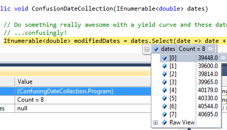

Have you ever had problems with numbers somewhere around 40,000 claiming to be dates? It could well be that you need a tool to help you quickly convert dates from the [OLE Automation Date](http://msdn.microsoft.com/en-us/library/system.datetime.tooadate.aspx) - aka OADate - format into something a bit more human readable. If so you're in luck, simply go to the [Life Beyond Fife GitHub repository](https://github.com/lifebeyondfife/Exhell) to get hold of the sourcecode, or [download the executable](http://lifebeyondfife.com/code/exhell/Exhell.exe). Or read on if you want a bit more background.

OLE Automation Dates, or more simply OA dates is a Microsoft standard for specifiying a date and time in a floating point number. The integral part refers to the date and the fractional part refers to the time. The date is recording as the number of days since 1 January 1900 so an OA date of 40,000 is 6 July 2009. The fraction of the number is the fraction of the day so far e.g. 0.25 means 06:00, 0.625 means 15:00. But I don't expect many people convert these things manually back and forward.

My first encouter with this dreaded format came several years ago when I was modifying FX option pricing code. Most financial instrument valuation requires lots of different market data stretching over the lifetime of the trade, generally at points where something of interest is happening to the trade, say, a payment is made or an interest rate is updated. Debugging this process in real-time therefore presented me with lots of infuriating lists like this.

Dates as doubles are handy for storage but not so much when you're trying to verify that the auto-generated list of dates for your valuation engine are correct. The non-programmatic practice for quickly converting between the two involved opening Excel, typing the number into a cell before changing its formatting to that of a date. Hardly convenient. For the debugging problem above, a Visual Studio plugin could be created but as double is an oft used value type, it didn't seem ideal.

I began thinking about how any two types of data - not just OA dates and human readable dates - could be converted quickly and unobtrusively within a desktop computing enviroment. It needed to be light-weight enough to be always running but anonymous enough not to take up space on the taskbar and required minimal interaction. This led to an idea to use an icon in the system tray and the clipboard mechanism.

The user would copy whatever they wanted converted into the clipboard, that only takes a couple of clicks or a keyboard shortcut. Next the cursor would hover over the icon in the system tray and the converted value would be shown as a tooltip.

In this case the conversion handles OA dates and human readable dates but the different types could be anything with a little programming. Other enhancements were made such as double-clicking on the icon to convert the contents of the clipboard. The converted date field can then be pasted into another application. In this case, both data types are strings but the clipboard can hold all sorts of data. A graphic designer constantly performing the same complex operation on an image could make use of this style of user interface.

The sourcecode for the conversion is done in just one function so it's ready to be opened up and tinkered with. Best of luck.
