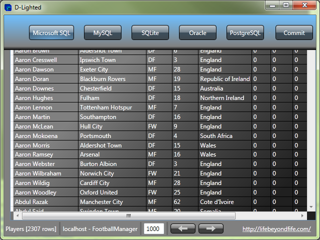
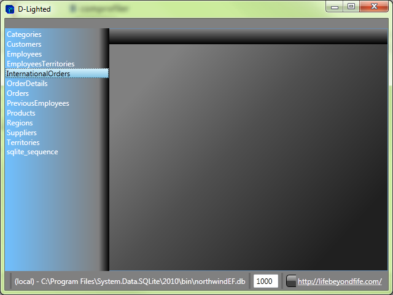
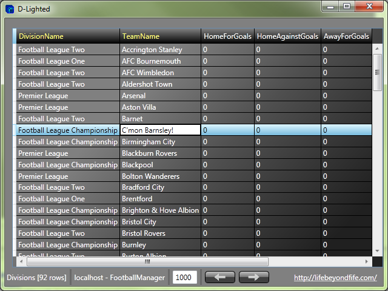
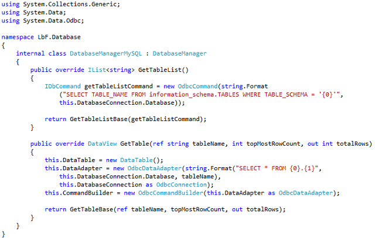
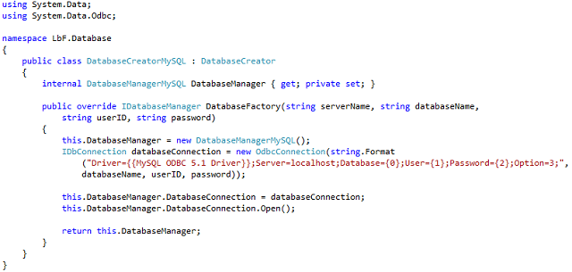

D-Lighted is a free, open-source Windows database tool that allows users to connect to multiple different database platforms all from within the same small executable. The simple, uncluttered user interface is perfect for DBAs or developers who need to get into a database quickly, open up a table and check the data, add or delete a row, or edit some values. D-Lighted currently supports connections to **Microsoft SQL**, **MySQL** (thanks to MySQL's [.Net Connector](http://dev.mysql.com/downloads/connector/net/)), **SQLite** (thanks to [System.Data.SQLite](http://system.data.sqlite.org/)), **Oracle** and **PostgreSQL** (thanks to pgFoundary's [.Net Data Adapter for PostgreSQL](http://pgfoundry.org/projects/npgsql/)) but visitors to this blog are free to request more in the comments section below. The installers and sourcecode can be found in the [downloads](https://github.com/lifebeyondfife/D-Lighted) section.

## Databases: Serious Business

As anyone who has worked on a large software project will attest, databases can be complicated beasts with accompanying behemoth tools for managing them. Mostly with good cause as a good setup for one application or web-service may have completely different requirements to another. However, it's quite often the case that different projects will require different database platforms entirely. And though SQL Server Management Studio, for example, is essential for configuring the throttling rate or the maximum number of simultaneous connections, 95% of the time its users just want to examine the data it holds and possibly edit a troublesome field.

With this in mind I updated a stripped down version of some [in-house development](http://www.lifebeyondfife.com/76-in-house.html) from some years back with a new WPF interface using the [M-V-VM](http://msdn.microsoft.com/en-us/magazine/dd419663.aspx) design pattern.

Hover the mouse cursor near the top of the window to reveal the connection buttons.

Hover it over to the left to reveal the list of available tables.

Everything else should be fairly self explanatory. Commit your database edits using the Commit or Left / Right buttons. Tooltips are placed on the modal dialogs for any specific connection details.

## Open to extension, closed to modification

Developers who wish to tailor D-Lighted to connect to different databases are in luck. By using the [Abstract Factory](http://en.wikipedia.org/wiki/Abstract_factory_pattern) pattern, all that needs to be implemented are three functions in two classes (and adding a button to the main XAML window).

Specify how to find the list of the table names available and also how to select all the elements from an individual table.

Finally, create an IDbConnection object to your database and that's it.

## Disclaimer

More than most software areas, database problems come under the, "well it works on _my_ computer" umbrella. Therefore if you come across any uncaught exceptions or things that plain and simple just don't work, please email me. The address is iain @ <this domain name>. Cheers.
