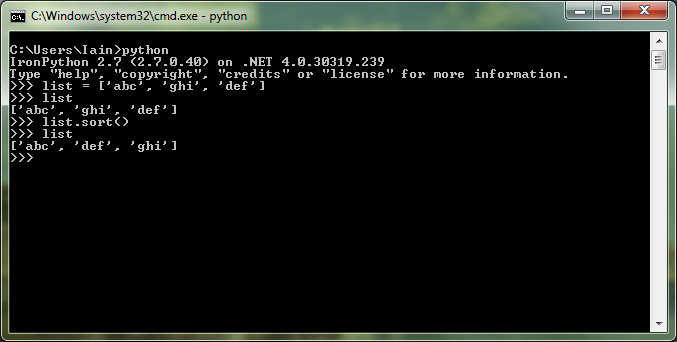
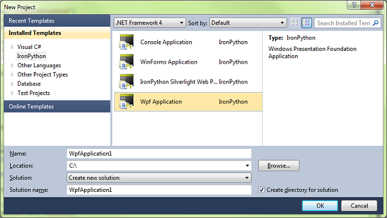
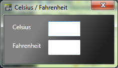
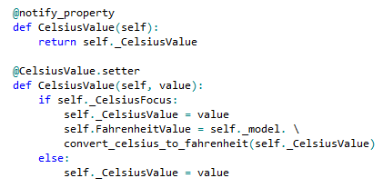
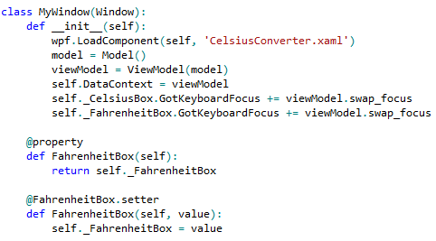

A project I recently started working on required me to install Python on my development environment - something I've not relished doing in the past. But with previous restrictions relaxed I was able to pick whichever version of [Python](http://www.python.org/) I liked so I chose the .Net implementation: [IronPython](http://ironpython.net/). Here's how I got on...

Many developers love Python and one of the reasons given by most who do is that the formatting is nice. I disagree. I miss the closing curly brackets that clearly separate one class, one function from another. My most common keystroke in Visual Studio is probably <Ctrl>+K, D which, if you have your [text editor settings](http://visualstudiohacks.com/options/c-code-formatting/) appropriately configured, will automatically format the entirety of your source file exactly how you want it. But frivolous trivialities aside I like the support of Python, the documentation, the maturity and scope of their libraries. I have three minor gripes with Python, however, which I'll probably feel better about once I've gotten off my chest.

## Dislike #1: Personal Bias

I found myself commuting every month or so to join an Agile Scrum team about a 1,000 miles away working on a very successful enterprise level trading platform. One developed in a place fully embracing [in-house development](http://www.lifebeyondfife.com/76-in-house.html) and all the lovely issues that creates. The most heinous crime though was the architecture. The build process was over a full Visual Studio version behind the curve, no support for adding managed code or replacing existing unmanaged code. All of that would have been bearable were it not for the central functionality being packaged as Python code wrapped in a statically compiled C++ string that is parsed at runtime by a Python interpreter _built into_ the product. It's not enough to use popular technologies, use them how they are meant to be used! Based on this being how I was introduced to Python I suspect I have a personal and irrational bias against Python through no fault of the language itself.

## Dislike #2: Dynamic Typing

I like the inclusion of the dynamic keyword to C#, whether as a means to remove excessive casting or to tidy up COM invocations. But the first thing you notice when examining a dynamic object in Visual Studio is that intelli-sense doesn't tell you anything. Some coders disliked intelli-sense when it was introduced as it risks [driving the direction of development](http://blogs.msdn.com/b/eric_carter/archive/2004/09/06/225989.aspx) but I'm a big advocate - you just need to make sure you know the libraries first. Intelli-sense doesn't let someone who can't code produce good applications, but it does let someone who can code navigate APIs and their own classes much more quickly. I like the benefits that static typing gives you in that your development tools know a lot about your program and can help out e.g. "I know that this object is of type A, and it implements interface IA. Would you like me to generate code skeletons for implementing IA in class A?" Yes, yes I would thanks.

## Dislike #3: Integrated Development Environment

I've been around long enough to remember programming when it was done by having a dozen text editors open (11 source code files and one makefile) and a command prompt to build and run your program. Back in 2000 as a tutor and lab demonstrator at university I was introduced to something called an IDE. More specifically: [Together](http://en.wikipedia.org/wiki/Borland_Together) - an integrated Java development environment written in Java. It was a complete mess, slow and buggy. It took Microsoft of all companies to convince me IDEs were a good idea. Visual Studio is still for me an amazing achievement and I've long since stopped being surprised at exactly how much assistance it provides developers. Like any addict, I'm hooked and can't go back - I need a good IDE that makes development feel challenging rather than frustrating, exactly what Eclipse does not do. There may well be good Python based IDEs but I regrettably have not found one yet.

## IronPython: The .Net implementation of Python

After I installed IronPython, added the installation directory to my path and copied ipy.exe to python.exe, I fired up a console and typed 'python'.

Worked pretty up as I expected / hoped. But before I moved on to setting up Django as I was originally meant to, I felt like a little digression (well, you're only on sabbatical once ;) If this was truly a .Net implementation, I should be able to use Visual Studio as my IDE and import the .Net libraries etc. This is indeed the case.

Despite how easy it would probably have been to knock up a quick WinForms or Console project, I thought I'd try to keep my WPF skills up and see how easy it would be to implement an M-V-VM application with WPF and IronPython.

## Celsius / Fahrenheit Converter

My favourite graphical user interface Hello World equivalent. Create a simple GUI with two text boxes and two labels. Every keystroke in either text box updates the converted value in the other. I started by designing this simple layout in XAML and even borrowed some gradient brushes from my [D-Lighted](http://www.lifebeyondfife.com/77-d-lighted.html) application. Were it not for the IronPython icon in the top left it would look like any other WPF application.

The obvious implementation methodology for solving a conversion problem is to use a [two-way bound data value and an IValueConverter implementation](http://stackoverflow.com/questions/4617216/wpf-binding-doing-a-temperature-converter-app). Unfortunately, as indicated by [DevHawk](http://devhawk.net/2008/11/17/ironpython-and-wpf-part-3-data-binding/), "_...in order to use a custom IValueConverter from XAML, you need to declare it in XAML as a static resource. However ... dynamic IPy objects don’t work as static resources._" They suggest possibly writing a C# converter that wraps a call to generic python code however I think if you're going to go down that route, why use Python in the first place?

I decided to bind both text boxes to a value in my View-Model. The problem here is that changing one value changes the other and we create an infinite loop. This was overcome by declaring a boolean state variable that switches when the text boxes focus events are fired. Not the most elegant solution ever but it meant that I got to accomplish two WPF tasks in Python: (a) bind a UI control to a variable and (b) subscribe to a UI event.

Binding a variable was a non trivial task and required getting hold of the python source code for [clrtype.py](https://ironpython.svn.codeplex.com/svn/IronPython_Main/Languages/IronPython/Samples/ClrType/clrtype.py). Another file from the IronPython tutorials was required, [pyevent.py](http://trac.geekisp.com/bleep/browser/trunk/IronPython/src/Tutorial/pyevent.py). Thanks also go to this hugely helpful blog post by Lukáš Čenovský on how to create a [notify property decorator and INotifyPropertyChanged implementation](http://gui-at.blogspot.com/2009/11/inotifypropertychanged-in-ironpython.html). Here is a code snippet from my View-Model:

Another possible "gotcha" is that you can't access any named XAML controls in the code behind [without decorating the name as a property](http://stackoverflow.com/questions/5853812/gui-development-with-ironpython-and-visual-studio-2010) otherwise, ahem, IronPython's tools kinda crash Visual Studio a little ¬\_¬

All in all, I'm quite happy with the Python implementation and the plug-in support for Visual Studio. The only real improvement I'd like to see is more online presence and support which is why, I think, I decided to write so much for such a small app and code sample. As always, feel free to download the entire GPL-ed source files in the [Downloads](https://github.com/lifebeyondfife/IronPythonWPF) section below.
