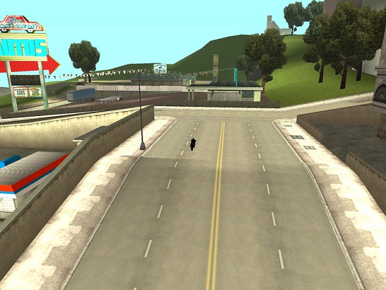
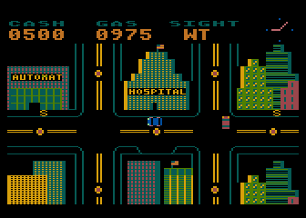
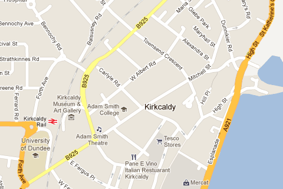
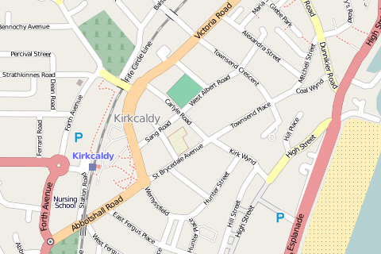

At university, the "What do you study?" ice-breaker didn't really work so well when your answer was "Computer Science". However, a historian friend of mine was by contrast frustrated at how open ended her subject area was. "So maybe no-one's particularly interested by what you do but when I say what I study it's always, 'Medieval History? Oh, I've heard of a King...'."

In a similar vein another friend of mine is a 3D artist making Playstation 3 games and he suffers from strangers "educating" him on what would make a good game. I know most of us have artistic ideas outside of our profession but most of them are probably quite bad. We just don't have enough experience, knowledge and, most crucially, objective industry understanding to know why. Do they think that this guy who has devoted his career to creating video games doesn't know what makes a good one? Or that he doesn't have a bunch of his own while being forced to make a rehash of the last one because video games are no different to any other industry: the bigger the budget to spend, the smaller the risk taken.

"Do you know what game you should make...?" they'll ask before expounding on the apparent wisdom only a fresh, uncorrupted outsider could produce. I suggest expecting about the same level of wisdom as Tom Symkowski in Office Space describing his ['Jump To Conclusions' mat](http://www.youtube.com/watch?v=8riXGpPFD34). So anyway with all that said, here's my awesome idea that could revolutionise gaming!

## Basic Game Idea

This blog was created primarily so I could formulate some of the ideas I've had from my experiences as a software developer in a global company and also to share my implementations and code for neat software ideas. I must state now that I'm disappointed that this post is just an idea but to be frank, I think the time required to knock up a proof of concept XNA application would be sizeable to say the least and the end product wouldn't be a game as such but simply a neat little prototype. To avoid another [IronPython debacle](http://www.lifebeyondfife.com/79-ironpython-wpf.html) (there's so little genuine Python interoperability I had to walk away from it entirely) I therefore sensibly opt to share the idea without any code.

When you're in a creative mood and your mind starts wandering it can be an intense experience. One idea seeds the next and before you know it you have too much to remember all at once. Notes have to be made so that all the tiny technical issues are recorded. By the end of my game-making mental exercise I had formed the idea of a first person perspective, massive multi-player online mining / scavenging game. In a nutshell, players would be on foot or in a vehicle in a vast open ended landscape trying to harvest a specific mineral deposit guarded by increasingly dangerous creatures proportionate to how much mineral they're defending. These deposits would have a real world currency value but in order to actually obtain them, players would need to spend time in the game honing their skill, increasing their avatar's abilities and possibly spending real world currency on better kit. In the game world like the business world, player teamwork i.e. clans, would be required to take on the biggest challenges.

The mental post-it notes stretch much further and deeper than this but that in essence is the idea. And it's not a particularly original one once you pick apart the individual details. Clans have been around since Quake, first person 3D games since Wolfenstein, on foot / vehicular combat since Battlefield 1942, the valuable mineral deposits idea was in Dune and game world to real life currencies have been around for ages in loads of games like, erm, Puzzle Pirates? I like [Puzzle Pirates](http://www.puzzlepirates.com/).

But I noticed there was one thing original about my idea and that was to do with the landscape itself. One I hope is so obvious it's only a matter of time before a major games publisher manages to work out the technical and legal details and use it in a mainstream game: don't make an artificial land for your game, use the landscapes, terrains and infrastructure from the real world.

## Places I've Lived

Growing up my family moved every 2-3 years with my father's career. I've lived all over the UK and even in a couple of central European countries. There are several towns I know my way around even after not having seen them for decades. But there are also places that have never existed that I know equally well and for me the first of these is Liberty City.

I remember being blown away by the first Grand Theft Auto game. Not GTA3, but the original top down quasi-3D game where the player was presented with a huge square city and allowed to go anywhere they liked. I loved how expansive and free-roaming the game was which was a breath of fresh air from the 90s' formulaic platform and FPS levels to be navigated in a set manner. GTA was finally picking up the baton left by the hugely enjoyable and, sadly, largely unheard of [N.Y.C.: The Big Apple](http://idiology.com/8b/bacardi/Synapse/Synapse_games_3.html) from 1984.

 To get anywhere in GTA, players had to know the layout of the city before attempting the missions. Even more so by the time Grand Theft Auto 3 came out for the Playstation 2 in glorious 3D. Not since the original Tomb Raider or The Legend of Zelda: A Link to the Past had I become so lost in the landscape of a game. I'd drive around the city taking everything in, the locations, the scenery, the different radio stations. It was a virtual city but the locations were real in my head.

And it got me thinking. If I can find my way around Liberty City, a place that doesn't exist, why can't I take advantage of the real places I already know within the environment of a computer game?

## Real World / Virtual World

It strikes me as odd that video games have for decades now been trying their hardest to exactly recreate the physics and nature of our planet without making as much progress on recreating our locations too. True, there are some examples such as [flight simulators](http://www.microsoft.com/games/flightsimulatorx/). Also, most modern racing games accurately recreate famous tracks and two examples in particular take it a step further along my line of thinking. [The Getaway](http://en.wikipedia.org/wiki/The_Getaway_%28video_game%29) recreated a subset of central London and [Test Drive Unlimited](http://en.wikipedia.org/wiki/Test_Drive_Unlimited) went a stage further and modelled an entire Hawaiian island. A sequel has since included the Spanish island of Ibiza. These recreations are expensive and extensive undertakings though. Every nook and corner is analysed from detailed satellite images. After discussing this with my 3D artist friend he plays the part of the industry insider well by pointing out obvious flaws. Companies and property owners object. They do not like copies or other worldly representations of their buildings to be made and it only takes one legal argument before the whole thing is deemed too risky.

## Don't copy the world, re-imagine it

The problem with ideas is that the devil is in the detail. You may think you've explained your simple idea completely but it's surprising how easily room for misunderstanding can squeeze into the tightest definitions. And once a few concrete examples occur they become beacons for those who want something tangible to help explain an idea. I pointed to a couple of example games that have recreated the real world to some extent. I will now hammer out the difference between that and my idea as, though it's a subtle distinction, it's a crucial one.

For those of you who use [Google](http://maps.google.co.uk/) or [Bing](http://www.bing.com/maps) maps, the UK has an alternative and it's called [Open Street Map](http://www.openstreetmap.org/). It's one of those heart-warming open and community driven solutions that don't seem to have quite the same polish or profile as those provided by big tech companies but offers much more as a result. Here is the centre of Kirkcaldy as shown by Google Maps and Open Street Map.

## Google Maps

## Open Street Map

Google have employed costly information gathering techniques from multiple sources. Open Street Map have a bunch of avid enthusiasts with a desire to walk around carrying a GPS device and a notebook. But here's the really interesting thing that Open Street Map will give you that the big map providers won't.

Extremely descriptive location based data detailing the make-up of the United Kingdom. And what is the screenshot of Open Street Map above but a graphics engine renderer? By cleaning up the XML format and combining it with global elevation data (for which there are many [datasets](http://vterrain.org/Elevation/global.html)) you have input for a 3D graphics engine. The granularity of the building and terrain descriptions is quite impressive: here's a residential house, there a hospital, church, school, there a golf course. The real world doesn't have to copied brick by brick in the virtual world, it can be seeded by these descriptions. In my original game idea I stated the landscape was a post-apocalyptic one. A building could look like the ruin of an existing one; it could look like an ancient Roman, Greek, Celtic variant; it could look like a futuristic bio-dome.

There are three advantages to this seeding approach. Firstly, we already have the data. You should occasionally force yourself to remember your feelings the first time you came across a technology you take for granted these days. The first time I saw Multi-Map, the bought out pre-cursor to Bing Maps, I spent some time looking at street maps of all the places I used to live. The amount of data we've collected since then is staggering and it's about time we used it for more than maps.

Secondly, legal issues regarding displaying exact replicas of buildings disappears. All the effort goes into the creation of the engine that produces the landscape from the data collected. This also means the game world is as big as the data set we hold of our world - a truly staggering amount.

Thirdly, a new element of human experience is brought into gaming. I could make use of my previously obsolete road atlas in the latest MMO game as a navigation aid (is it just me who likes the idea of driving up the M6 in a tank?). Racing round certain locations would give me instinctive home advantage as so much of it would already be indelibly committed to memory. As a final twist, subscribers of pay to play games could be given a start location near, or even at, their credit card's billing address. Gaming unions and rivalries could be fun local ones too. Going on holiday somewhere? Learn your way around the city before you arrive. The possibilities are certainly abundant.

I think I've managed to convince myself to install XNA and waste some of my time on this after all \*sigh\*
