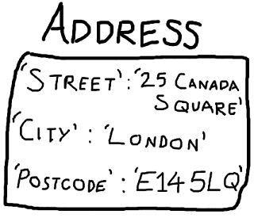
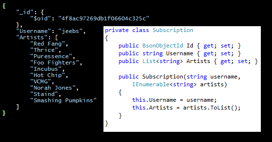
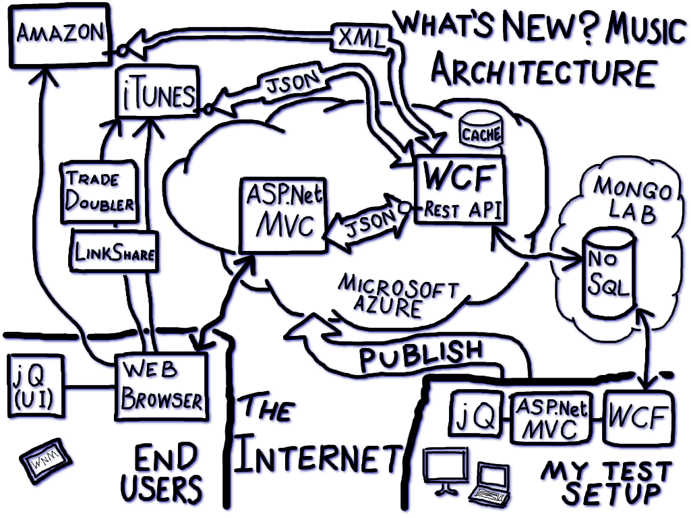

Welcome back guys! Wow, it's really hard to get code out of the door when you've got to work full-time. Still, no matter, here is how I got on with my latest project: extending the previous one until it's bashed out into something a bit more useful.

To give a bit more background on just what the [previous blog post was about](http://www.lifebeyondfife.com/88-restful.html), it was an ASP application knocked up quickly over the course of a weekend to give me something to show for an interview I had with Scotland's premier web technology company, [Sky Skanner](http://www.skyscanner.net/) (setup via the awesome [Quantum Recruitment Consultants](http://www.quantumpeople.com/it.asp)). It was the first step into a web / phone service that lets a user know what the most recent releases are by a set of favourite artists. This blog post details its continuation and my first foray into using a NoSQL database.

The problem with the first attempt was that it didn't cope with different users and it was session based i.e. no external storage. A [recent post](https://twitter.com/#%21/koenmetsu/status/184198447161806848) on my twitter feed charted how to get started with NoSQL. For those of you who aren't in the know, NoSQL is a database platform but unlike most based on the classic SQL design, is non-relational. No joining queries across multiple tables. No guarantees about safety and synchronised operations. I'll include my obligatory link to the [wikipedia page](http://en.wikipedia.org/wiki/Nosql) but the best way to think about it is that a table is a collection of 'key => value' pairs.

Above illustrates one entry in the Address table. Each value that makes up the address is keyed on another piece of data. The value could be a string, number, date etc. or even a list of these types.

#### To The Cloud!

Despite being a Scotsman I'm not cheap, but I do like to get away without paying for software or tech services wherever possible (Hey, I release my sourcecode GPLed, share and share alike I say!). Being directed to the frankly awesome [MongoLab](https://mongolab.com), therefore, suited me right down to the ground for two reasons. Firstly, it wraps up in a neat package the ability for registered users to have a Mongo DB instance hosted in the cloud of your choice: [Amazon](http://aws.amazon.com/ec2), [Rackspace](http://rackspacecloud.com/) or [Joyent](http://joyentcloud.com/). Secondly, I should explain that [Mongo DB](http://www.mongodb.org/) is a type of NoSQL database with drivers for several different languages, one of which is my beloved C#.

On the plus side a recent release at the end of March has introduced LINQ support which makes searching for records a dream. On the downside, the API isn't documented and I found using it a bit random as to whether it would do what I expected. Some statements did update my tables as required, some didn't. Hopefully you'll be able to learn from the attached sourcecode. On the whole it didn't take long to get my head round using a NoSQL database and was quite impressed at how well the drivers mapped container classes I had constructed to and from the cloud.

_Just a few of my favourite artists saved in the 'subscriptions' table_

## Service Oriented Architecture

The final vision for this service is that it can be accessed via a web browser or phone. This decoupled RESTful web service allows me to do this by writing different front ends communicating using these four http requests alone:

- GET: /username - returns the most recent albums by the user's subscribed artist
- GET: /username/from/to - returns a specific subset of the user's results as above
- PUT: /username/artist - adds an artist to a user's list of subscribed artists
- DELETE: /username/artist - removes an artist as above

There is no authentication required, a user must choose a significantly unique name and they have full access over the artists that name subscribes to. Such a system is already in place for image hosting site [b3tards](http://www.b3tards.com/uploader.php), and although this also makes implementation significantly easier, I feel this is actually a [superior system to the archaic](http://www.codinghorror.com/blog/2010/12/the-dirty-truth-about-web-passwords.html), "Sign up, give me an email address, a password, your facebook and twitter name etc." I could introduce functionality to let a user be emailed automatically if there are updates to their subscribed artists, but I like how that would be a voluntary thing.

The database schema is pretty straightforward so far. I've added a couple of 'freshness' tables that will let me know (a) when to refresh an artist's data in case they've released a new album, say, once a week and (b) when I should drop that user who hasn't been back in over a year.

## Cached and Optimised

Those who read the previous blog post when this was an initial idea might recall one quite bad shortcoming. I'm getting data from [MusicBrainz](http://musicbrainz.org/) who ask users to send only one request per second. Fair enough really, they're hosting the details of every bit of music ever produced, like, ever. I therefore only ever want to ask MusicBrainz about an artist once and only go back to update at timely intervals. All album information from the last three years - I'm only really interested in telling users about new releases - gets committed to my Mongo DB instance. Further to that, I also use Microsoft Enterprise Library to automate [caching user data](http://msdn.microsoft.com/en-us/library/ff664753%28v=pandp.50%29.aspx) (though after looking for a link to the documentation, I discover that new projects should use the functionality in the [System.Runtime.Caching](http://msdn.microsoft.com/en-us/library/system.runtime.caching%28VS.100%29.aspx) namespace). Once a user checks their list, they can come back any time and unless the load on the server is busy, their artists will still be in memory. An added bonus is that any artist they're interested in will as a consequence be stored for all other users.

## Where Next?

The plan is to continue with this until it's a fully fledged Web 2.0 service. With flashing bells, whistles and a massive whoring for attention on social media. I'll start with a web site first and then if there's any interest make that phone app. For now though, please feel free to download the sourcecode and look at the RESTful ASP.Net architecture and Mongo DB interfacing. However, I should stress that while my code is free as in speech, _**access to my database is not**_ so the code does not contain the vital server connection details and password. Unless you have a Mongo DB instance of your own to hook it up to, the code won't really do that much. I advise you not to let that stop you but instead convince you to do some further digging around to get something going. It's not as hard as it looks, best of luck.
