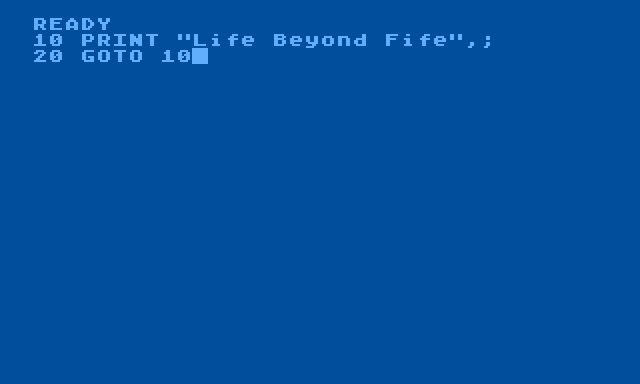
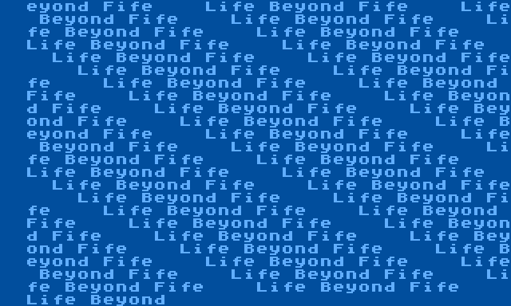

For as long as I can remember I've been programming and I never seriously thought about doing anything else for a living. But becoming and _remaining_ a software developer is a journey, not a destination. See if you can identify with this situation: I worked for the same company for six years and though I kept up with the latest .Net changes as my job required ("LINQ eh, what's that?") I didn't really learn much new. By the end of my time there I realised things were far from right. It wasn't that I didn't know relevant technologies that propspective employers would be interested in, it was something harder to pin down than that. So at the start of my sabbatical last summer I was excited to try learning a few new technologies and software development practices to put me at ease again.

By the end though I came to the realisation that being a modern software developer is more than just knowing how to use the latest fashionable github fork or javascript library. I had lost my mojo and hadn't even noticed. The mojo I had back when I was a student and lost while being too damned focussed on becoming a proper professional software developer. I'll share with you what I had, lost, and regained - and how you can make sure you never do the same.

## Learning to Code

Like many children of the 80s who went on to become computer programmers, it all started with BASIC on the home computer. Mine was the [Atari 800XL](http://en.wikipedia.org/wiki/Atari_8-bit_family) which had an impressive 128K. I tinkered with a couple of variations at school e.g. [QBasic](http://en.wikipedia.org/wiki/QBasic), before starting an undergraduate Computer Science degree where they had their own implementation of [Algol](http://en.wikipedia.org/wiki/S-algol) designed specifically for teaching programming. It wasn't until my second year that I was introduced to something that was actually used by the wider industry. In [this GitHub repo](https://github.com/lifebeyondfife/SimpleCalculator) is a makefile, source and header files for my first ever C practical from the late nineties. From the console of a Unix system type 'make calculator' for a simple command line based calculator (I was pleasantly surprised it actually compiled, then disappointed at how unusable it was).

It gave me a huge amount of confidence knowing that I was picking up the skills I needed to be a professional programmer. It was as if Mr Miagi who had for years being showing me "Wax on, wax off", had finally decided I could actually be shown how to do karate. A couple of years later I was making a desktop application with a rich Java Swing user interface for my senior honours project. I can't tell you just how bad this program actually was but I have a screenshot that shows off a passable use of menus and buttons along with a dog slow home rolled 3D library implementation.

By the time I had finished my undergraduate degree I was still far from being what I'd call a competent software developer but I had confidence. Confidence I knew how to use the latest tools and I could build something kinda cool from scratch without anyone's help.

## Oh yes, I'm a _Professional_ Software Developer

Fast forward a few years to the end of my PhD, I had decided academia wasn't for me and I'd probably be much happier making software for a living. I was pretty excited therefore that a company thought I had the skills to join their team as a C developer, creating and supporting real time servers for European ticker plant feeds. The culture change was intense - I was working with a codebase several orders of magnitude larger than anything I'd seen previously. I was spending a lot more time looking at and toiling over the same code day after day, debugging and refactoring, rather than writing new things.

A quick change of company and I had branched out to working on an even larger codebase for a product - still available today - that was started back in the mid nineties. I was working on C++ and COM legacy code interfacing it with C#. It was complex technical stuff ensuring that this collosal system was kept up and running. Looking back now I thought I was doing serious and important development tasks; that I would always be in demand just because I was familiar with implementing a COM (de)register in a .Net language.

## Realising What Was Missing

When I started my sabbatical it was to refresh my enthusiasm for development but from a practical sense all I thought I'd get was a few new bullet points on a CV. It wasn't until after a few projects I began to notice I was doing once more what I used to as a university student, when at school, when messing around on my Atari 800 XL... what I didn't do as a professional software developer, what I'd stopped doing and almost forgot how to do.

If you were to write Facebook, Google, Amazon or Stack Exchange from scratch as they are today, well, you simply couldn't. It would take too long. But the first version wouldn't. The first version was an idea that one or two people had and could see through to completion in a reasonable timescale. Professional software developers spend almost all their time neck deep in code they're debugging or extending they forget how to build things themselves. From my time reading other people's blogs, keeping up with announcements on Twitter and cool new start-ups on Hacker News you notice a pattern. Just like the professional software developers in their 9 to 5 jobs, entreprenurial hackers are using the best new tools and technologies. But more than that they're building things, complete things from start to finish. They're setting up their own databases, configuring their servers, rolling their own CSS templates and getting something out of the door, not simply building a DLL that takes an XML document validated against an XSD and implementing an interface - all of which were provided by someone else.

Working on my own projects shone the light on my part as a maintainer of large software systems and how I was just one part of the jigsaw. My programmer mojo isn't just about knowing how to use the latest technologies and software development practices. Even though we as programmers can make astounding things when we work together, I've remembered what 10 year old me found out pretty quickly. It's having the skills, vision and determination to write something on your own from start to finish. From starting this blog and sharing my programs I've got my mojo back - I'll make sure I won't lose it again.
