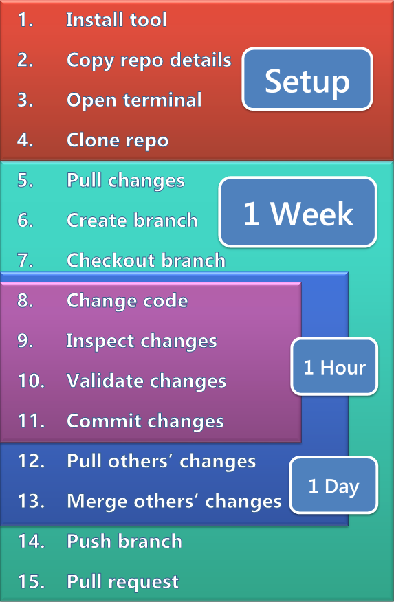
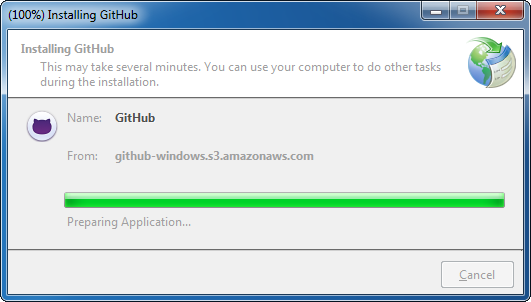
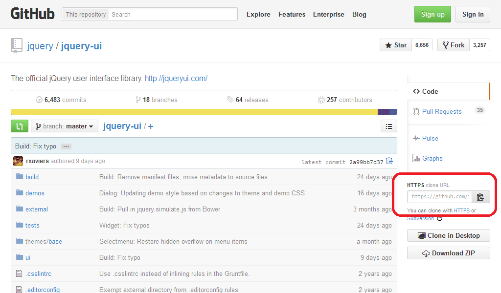
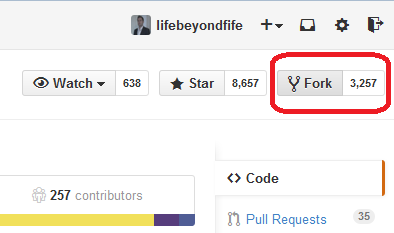
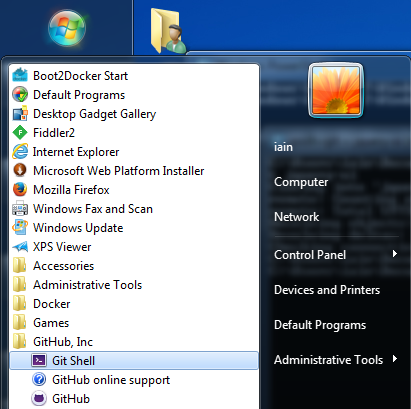
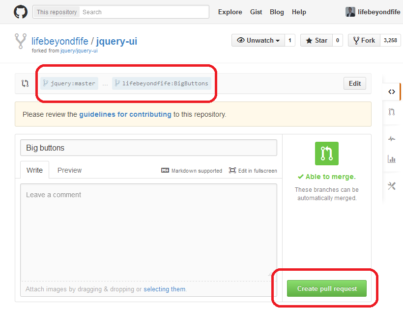

The web is awash with introductions and guides to using git. There's [this visual guide here](http://www.wei-wang.com/ExplainGitWithD3/), [that interactive tutorial there](http://pcottle.github.io/learnGitBranching/), [reams of documentation](https://www.kernel.org/pub/software/scm/git/docs/), and of course [all kinds of troubleshooting help](http://stackoverflow.com/questions/tagged/git).

But if you're coming from a traditional Version Control System (SVN, Perforce, Clearcase etc.) the main barrier to using git is not answering the question, "How to I checkout and commit code changes?", but rather, "How do I use all these complex features to develop software?"

This guide is a complementary resource to the others, providing a working template of how you should use git in order to deliver discrete software features in a distributed and collaborative environment. By providing an example workflow that beginners can start using, they will not only learn, say, _how_ to create a branch, they will start to understand _why_ git has branches in the first place.

 

For the sake of simplicity we'll assume the user is contributing to a GitHub project from a Windows operating system but the lesson applies equally to other git hosting platforms and operating systems.

 

## The Git Workflow

 

Once you've read this article in full, refer back to this diagram, of which there are two main elements:

 

- The instructions which refer to specific git commands
- The three implicit loops that exist in this workflow

 

This workflow assumes, and unrealistically so, a fairly straightforward progression where nothing goes wrong. When it _does_, consult the resources linked to at the beginning of this guide. The central idea is that **we wish to add one feature to an existing repository**. To do so we **create one branch**,which is where we persist the code changes for this feature. Once the feature has been completed, we **push this branch to GitHub**, and **merge it back into the original master branch**.

 

Let's begin by expanding the numbered items in the diagram

 

## The Git Commands

 

**1.** Download and install GitHub's tool for windows: [https://windows.github.com/](https://windows.github.com/). The executable can be found directly here: [http://github-windows.s3.amazonaws.com/GitHubSetup.exe](http://github-windows.s3.amazonaws.com/GitHubSetup.exe)

 

 

**2.** From a GitHub repo you're interested in, copy the clone string from the right of the screen - search for "HTTPS clone URL". For this initial example, I've selected jQuery-UI.

 

In order to commit the changes back to GitHub's servers, a fork of the project is required in your own repo space. Login to GitHub and click on the Fork button at the top right of the same page.

 

 

 

**3.** Run GitHub's Git Shell tool and navigate to the directory where you'd like your code to live.

 

 

**4.** Run the following command to clone the repo. NB – you'll have the jQuery-UI git URL in your clipboard.

C:\\Users\\iain\\Documents\\GitHub> git clone https://github.com/jquery/jquery-ui.git jquery-ui Cloning into ‘jquery-ui’… remote: Counting objects: 59735, done. remote: Total 59735 (delta 0), reused 0 (delta 0) Receiving objects: 100% (59735/59735), 23.90 MiB | 6.54 MiB/s, done. Resolving deltas: 100% (42995/42995), done. Checking connectivity… done. C:\\Users\\iain\\Documents\\GitHub> cd .\\jquery-ui C:\\Users\\iain\\Documents\\GitHub\\jquery-ui **\[master\]**\>

 

This is the conclusion of the Setup phase – reward yourself with a cup of tea if you'd like. These steps do not need to repeated for the jQuery-UI project. If you wish to work on another project, start again from Step 2.

 

 

**5.** Pull changes from the central master repository. If you've just completed Step 4, you'll see the output below. However, if this is the beginning of a new loop, there may well be changes to be pulled down.

C:\\Users\\iain\\Documents\\GitHub\\jquery-ui **\[master\]**\> git pull Already up-to-date. C:\\Users\\iain\\Documents\\GitHub\\jquery-ui **\[master\]**\>

 

 

**6.** Before making any changes yourself, create a new branch for the feature you want to make. Never, ever, ever make changes to the master branch directly. Ever!

C:\\Users\\iain\\Documents\\GitHub\\jquery-ui **\[**master\]\> git branch BigButtons C:\\Users\\iain\\Documents\\GitHub\\jquery-ui **\[**master\]\> git branch   BigButtons \* master C:\\Users\\iain\\Documents\\GitHub\\jquery-ui **\[master\]**\>

 

 

**7.** Checkout your new branch.

C:\\Users\\iain\\Documents\\GitHub\\jquery-ui **\[master\]**\> git checkout BigButtons Switched to branch 'BigButtons' C:\\Users\\iain\\Documents\\GitHub\\jquery-ui **\[BigButtons\]**\>

 

 

**8.** Change the code! As you do, hitting return on the console will let you know about changes you've made. These numbers refer to the count of files added, lines altered, and files deleted, respectively.

C:\\Users\\iain\\Documents\\GitHub\\jquery-ui **\[BigButtons\]**\> C:\\Users\\iain\\Documents\\GitHub\\jquery-ui **\[BigButtons+0 ~2 -1\]**\>

 

 

**9.** Before we can persist these changes, we need to let git know explicitly that we want to make them. First we'll check what the changes are so far to verify they're intended. A high level overview is shown using the status command.

C:\\Users\\iain\\Documents\\GitHub\\jquery-ui **\[**BigButtons+0 ~2 -1\]\> git status On branch BigButtons Changes not staged for commit: (use “git add/rm …” to update what will be committed) (use “git checkout — …” to discard changes in working directory)  
**modified: themes/base/base.css** **modified: themes/base/button.css** **deleted: themes/base/progressbar.css**  
no changes added to commit (use “git add” and/or “git commit -a”) C:\\Users\\iain\\Documents\\GitHub\\jquery-ui **\[**BigButtons+0 ~2 -1\]\>

 

A more detailed look can be found using diff.

 

C:\\Users\\iain\\Documents\\GitHub\\jquery-ui **\[BigButtons+0 ~2 -1\]**\> git diff **diff –git a/themes/base/base.css b/themes/base/base.css** **index 479c327..89a5def 100644** **— a/themes/base/base.css** **+++ b/themes/base/base.css** **@@ -17,7 +17,6 @@** @import url(“dialog.css”); @import url(“draggable.css”); @import url(“menu.css”); **\-@import url(“progressbar.css”);** @import url(“resizable.css”); @import url(“selectable.css”); @import url(“selectmenu.css”); **diff –git a/themes/base/button.css b/themes/base/button.css** **index 43ff15c..b64c624 100644** **— a/themes/base/button.css** **+++ b/themes/base/button.css** **@@ -45,9 +45,7 @@**button.ui-button-icons-only { .ui-button .ui-button-text { display: block; line-height: normal; **\-}** **\-.ui-button-text-only .ui-button-text {** **\- padding: .4em 1em;** **\+ font-size: 180%;** C:\\Users\\iain\\Documents\\GitHub\\jquery-ui **\[BigButtons+0 ~2 -1\]**\>

 

The changes made are all explicit. Styling is being removed on progress bars, buttons are losing their padding in favour of increased font size.

 

 

**10.** Once happy with the changes you want to make. You need to specifically add changed and new files, and remove deleted files.

C:\\Users\\iain\\Documents\\GitHub\\jquery-ui **\[BigButtons+0 ~2 -1\]**\> git rm themes/base/progressbar.css rm ‘themes/base/progressbar.css’ C:\\Users\\iain\\Documents\\GitHub\\jquery-ui **\[BigButtons+0 ~0 -1 |+0 ~2 -0\]**\> git add themes/base/base.css themes/base/button.css C:\\Users\\iain\\Documents\\GitHub\\jquery-ui **\[BigButtons+0 ~2 -1\]**\> git status On branch BigButtons Changes to be committed: (use “git reset HEAD …” to unstage)  
**modified: themes/base/base.css** **modified: themes/base/button.css** **deleted: themes/base/progressbar.css**  
C:\\Users\\iain\\Documents\\GitHub\\jquery-ui **\[BigButtons+0 ~2 -1\]**\>

 

Checking the status now sees the changes coloured in green to denote that we've confirmed these are intentional changes.

 

 

**11.** The last step in persisting your changes into a single checkin: commit your changes. Only because this is an example walkthrough, we'll break the best practice rule of checking in two feature changes on one commit ;)

C:\\Users\\iain\\Documents\\GitHub\\jquery-ui **\[**BigButtons+0 ~2 -1\]\> git commit -m “Make the button font size larger. Remove styling on progress bars.” \[BigButtons e078989\] Make the button font size larger. Remove styling on progress bars. 3 files changed, 1 insertion(+), 32 deletions(-) delete mode 100644 themes/base/progressbar.css C:\\Users\\iain\\Documents\\GitHub\\jquery-ui **\[BigButtons\]**\> git status On branch BigButtons nothing to commit, working directory clean C:\\Users\\iain\\Documents\\GitHub\\jquery-ui **\[BigButtons\]**\>

 

The status command show the working directory is clean i.e. there are no changes to be committed. Using the log command can show the previous commits made to this branch.

 

C:\\Users\\iain\\Documents\\GitHub\\jquery-ui **\[**BigButtons\]\> git log –oneline -n 5 **e078989** Make the button font size larger. Remove styling on progress bars. **2a99bb7** Build: Fix typo **24ce1c8** Dialog: Updating demo style based on changes to theme and demo CSS **fe75984** Easing: Fixed small typo in easing demo **b5f1ffd** Build: Remove manifest files; move metadata to source files C:\\Users\\iain\\Documents\\GitHub\\jquery-ui **\[BigButtons\]**\>

 

Even though only one commit has been made to this branch, BigButtons shares the ancestory of the master branch and all its previous commits.

 

 

**12.** Now we want to put our changes back onto the repo server. But alas, our colleague has told us they updated the master branch while we working on our changes!

First let's get the latest version of the master code. Begin this by moving from the MakeButtonsRectangular branch to the master branch.

C:\\Users\\iain\\Documents\\GitHub\\jquery-ui **\[**BigButtons\]\> git checkout master Switched to branch ‘master’ Your branch is up-to-date with ‘origin/master’. C:\\Users\\iain\\Documents\\GitHub\\jquery-ui **\[master\]**\> git pull Updating 24ce1c8..2a99bb7 Fast-forward ui/resizable.js | 2 **+\-** 1 file changed, 1 insertion(+), 1 deletion(-) C:\\Users\\iain\\Documents\\GitHub\\jquery-ui **\[master\]**\>

 

 

**13.** You now have an up-to-date version of master including your colleague's changes. You need to merge their changes into your branch.

C:\\Users\\iain\\Documents\\GitHub\\jquery-ui **\[master\]**\> git checkout BigButtons Switched to branch ‘BigButtons’ C:\\Users\\iain\\Documents\\GitHub\\jquery-ui **\[BigButtons\]**\> git merge master Merge made by the ‘recursive’ strategy. ui/resizable.js | 2 **+\-** 1 file changed, 1 insertion(+), 1 deletion(-) C:\\Users\\iain\\Documents\\GitHub\\jquery-ui **\[BigButtons\]**\>

 

 

**14.** Your branch is now ready to merged into the master branch on the repo server. You pulled their changes, you push your changes.

C:\\Users\\iain\\Documents\\GitHub\\jquery-ui **\[BigButtons\]**\> git push -u https://github.com/lifebeyondfife/jquery-ui BigButtons Username for ‘https://github.com’: lifebeyondfife Password for ‘https://lifebeyondfife@github.com’: Counting objects: 34, done. Delta compression using up to 2 threads. Compressing objects: 100% (7/7), done. Writing objects: 100% (8/8), 802 bytes | 0 bytes/s, done. Total 8 (delta 5), reused 0 (delta 0) To https://github.com/lifebeyondfife/jquery-ui \* \[new branch\] BigButtons -> BigButtons Branch BigButtons set up to track remote branch BigButtons from https://github.com/lifebeyondfife/jquery-ui. C:\\Users\\iain\\Documents\\GitHub\\jquery-ui **\[BigButtons\]**\>

 

NB – because we don't have admin rights to the jQuery-UI project, we push the changes not to where we originally cloned the repo from, but rather to our personal fork. If you were pushing a change back to the same server as where you initially cloned the repo, swap \-u https://github.com/lifebeyondfife/jquery-ui for origin.

 

 

**15.** Final stage. Go to the GitHub website and make a "Pull Request" for your branch. An administrator will then review your branches changes and will either accept it or suggest changes.

 

 

 

## The Git Cycles

 

Now that we're familiar with some of the features of git, let's return to the three loops that exist in this workflow. They each have an upper bounded time limit that you should aim to stick to. Frequently going over these time windows suggests working practices that aren't conducive to good software development.

 

### **One Hour Loop**

The most important loop. Whenever you're actively writing code, you should be looking at the changes you're making and commiting them to your local branch at least once per hour. The code doesn't need to be in a working state with all unit and integration tests passing – think of this like hitting a save point while playing Tomb Raider. Consistently committing the changes you make means that you never waste more than one hour undoing a coding mess you've inadvertantly created.

In the days of SVN you couldn't make checkins as frequently as this because your changes would go back to the server that everyone else was using. The automated tests would be run and your change would be rejected if anything was awry. With git, however, your local branch is yours to break and experiment as you see fit.

When you start actively developing note that once an hour you should complete a loop of Step 8 to Step 11.

 

### **One Day Loop**

When you have a busy period of multiple people all making code changes at once, complex and large threeway merges are commonplace. With git's merge feature and independent code branches each based on a common ancestor, you're free to merge the changes from other developers as frequently as you like.

Merging others' changes that have been accepted by the build server should be done once a day. This will hopefully result in more "happy path" merges where git does all the work for you. At the very least though, you spread the work of any complex threeway merges over several days while your code changes are being worked on.

The daily loop includes the steps from the hourly loop and in total describe Step 8 to Step 13.

 

### **One Week Loop**

Strictly speaking these loops are all suggested upper bounds, none more so than the weekly loop. Development features should be as discrete as possible and take no more than one week to finish. You may end up completing this loop every half day, for example.

Once your changes are finished, with all unit, integration and acceptance tests passing locally, it's time to submit your changes to the build server. After your branch is on the same remote server as the master branch, and your changes have been merged back in, it's time to begin the loop again.

The feature branch you created is no longer required and can be removed from the buildserver and yours as well if you wish.

The weekly loop incorporates the the previous daily and hourly loops and in total describes steps Step 5 to Step 15.
