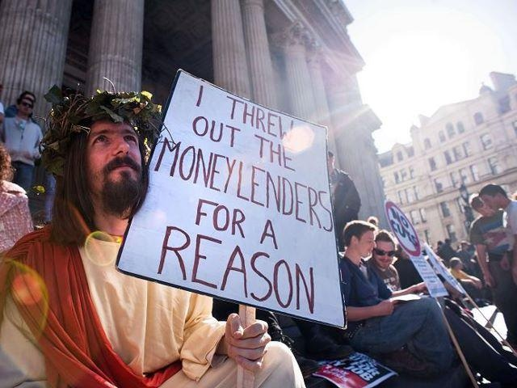
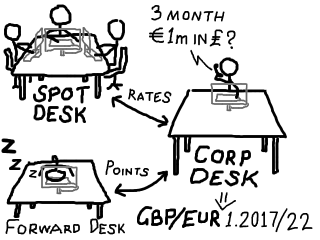
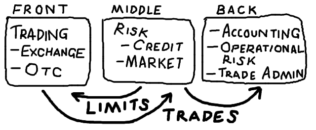

I truly believe that banks, or any institution that exists by making trades based on [financial instruments](http://en.wikipedia.org/wiki/Financial_instruments), is not inherently evil. I stand by that statement even though it flies in the face of overwhelming [public opinion](http://www.time.com/time/specials/packages/article/0,28804,2101745_2102134_2102358,00.html). They – the institutions and their employees – can make obscene profits both [individually](http://news.bbc.co.uk/1/hi/business/8254424.stm) and as [corporate entities](http://www.guardian.co.uk/business/2011/apr/19/goldman-sachs-smashes-forecasts-first-quarter-profit); they may [gamble recklessly](http://blogs.ft.com/economistsforum/2011/04/don%E2%80%99t-let-banks-gamble-with-taxpayer-money/) with the hard earned money of others; they may charge those near the breadline with [unreasonable rates further compounding their problems](http://www.estateagenttoday.co.uk/news_features/A-million-people-take-out-4-000-payday-loans-to-pay-their-mortgages); they can offer [little support to struggling businesses](http://www.telegraph.co.uk/finance/newsbysector/banksandfinance/8848660/Treasury-may-bribe-banks-to-lend-to-small-businesses.html) when they need it in a harsh economic climate which, ultimately, was caused by a credit bubble of unresponsible lending by the banking sector in the first place.

In writing this article though I'm trying to defend the idea of banking and as a software developer shed light into what goes on in the glass skyscrapers. I have never been close to the top 1% of earners nor worked for a bank but I have worked in the finance industry primarily developing market risk software. I think everyone should be able to stand up and justify what they do for a living and I submit that most people who object to the banking sector do so based on anecdotes of repugnant behaviour from banks and bankers alike. Believe me, I'm not trying to deny the existance or incredulity of the many examples. The most jaw dropping example I've seen is the [Deutsche Bank employee](http://www.mirror.co.uk/news/top-stories/2011/03/20/exclusive-city-banker-sacked-after-taunting-nhs-staff-with-10-note-115875-23001700/) who waved a £10 note and shouted "Get a job!" to a procession of striking nurses.

But before you can convincingly argue against a system you have to understand it. One person may object to the existance of banks without realising that their lives fundamentally depend on them. It's important therefore to know exactly what it is that banks do, how they work, the services they provide. I hope to provide a high level description of what banking does, how they do this and as usual [I have some GPL sourcecode](https://github.com/lifebeyondfife/FinancialPricer) that executes a few financial calculations required by banking software.

## "How can banking not be evil, banks do evil things?"

A bank is a business like any other. There is a big divide in business though and it comes down to ownership: is the business publicly or privately owned? If it's privately owned, the aims and objectives of the company could be noble, they could be anything – it's hard to truly know. As soon as a company floats on an exchange and becomes publicly owned that goes out of the window. Regardless of the best of intentions, the people who paid money to invest in the company own it and they can change the people at the very top it if they want to. The investers want a return, either a dividend or an increase in share price. Everything else goes out of the window. As soon as Google went public, the ["do no evil"](http://www.google.com/about/corporate/company/tenthings.html) bullet point in their company policy became nothing more than a piece of good PR. It may well help to have a non-evil public image and a healthy work culture, but as soon as it stands in the way of profit the shareholders will bring in someone who doesn't care about whether what they do is "evil" or not.

And this is a cornerstone point of capitalism. Business isn't immoral: it's _amoral_ – it has absolutely no morality which it lives by. It just wants to make money. A business plan is drawn up to make money and employees are paid to follow that plan. We all know businesses don't always play fairly. To look at an issue that technical people are familiar with, recall the [antitrust case against Microsoft](http://www.justice.gov//atr/cases/f3800/msjudgex.htm#vb) regarding the prominent bundling of Internet Explorer with the Windows operating system. They used their market share to create a software monopoly. Monopolies are bad for consumers and that's why as well as the US taking umbrage, the European Union also [stepped in to fine them](http://news.bbc.co.uk/1/hi/7266629.stm). This is the next thing to be aware of concerning business. Unless governments are strong and stand up to them, they won't follow the rules. These "too big to fail" banks saw all their competitors make steady profits ramping up lending. They probably didn't see it as a choice between risking more capital for a greater payoff or government bail out, they probably thought the former would always pay out. The banks have been playing in an environment where in order to attract banks, all the governments in the world offered them a [soft deal](http://www.economist.com/node/9949843) and they gladly accepted.

If your complaint against banks is that they act purely in their own self interest to the detriment of all others then you're not against banking per se but business in general. Governments walk a tight-rope between being business friendly to attract investment and protecting the rights of its citizens. Individuals telling banks (or anything other business) to behave differently won't accomplish anything, governments need to be told by their electorate to regulate and police more if that's what the voters want.

## "Yeah, but some businesses are good for society. We should stop those that aren't!"

A business is simply a provider of goods and/or services. Banks are primarily a service based industry but what exactly do they provide? For most of us, they look after our montly deposits and savings securely, allowing us instant and convenient access. They also pay interest to savers and charge interest to borrowers. But that's an incomplete description of what they do based on our narrow view of what we as consumers want from the bank.

The moneylenders have always had a bad press. There's the millenia old story of Jesus [throwing them out of the temple](http://bible.cc/matthew/21-12.htm). Today people still question the societal worth of banks. I find societal worth a strange concept. I dislike the fast food industry because it makes a profit while making the public unhealthy but it exists because fast food is popular. Capitalism is the ultimate democracy – you only get to vote for a government once every five years but you vote with your conscience everytime you open your wallet e.g. do you buy barn or free range eggs? Do you ensure the meat you buy from the supermarket brought the farmer a fair price and there was a good standard of animal welfare? Do you check the country of origin of the clothes and products you buy and ensure their citizens enjoy political freedom and humane labour laws? Do you buy music from RIAA or independent artists? The Co-operative Bank understands this and [discloses a list of industries](http://www.goodwithmoney.co.uk/ethical-banking/) in which it won't invest consumer deposits. Most companies offering trackers for ISAs, for example, will offer some sort of ethical fund. But societal worth is too subjective a term, businesses exist if there is a need for them regardless of whether some individuals consider them worthy or not.

To me at least, banking in general has great societal worth. Most people in work either run a business or work for a business – both are needed. Being an employee is the most common choice for several reasons. There is less risk and more continuity – you will be paid the same amount on the same day every month. That kind of certainty allows you to make plans for the future. Most employees also work less than 40 hours a week. There are countless other benefits for those who choose to work for a business. However, that makes everyone who does so (and all those who depend on those that do) in need of those who own and run businesses: entrepreneurs. We are all indebted to the risk takers, the people who choose to devote every waking minute to making a success of their business.

Banks provide some services to consumers but are much more vital to entrepreneurs and established businesses for starting and maintaining their day-to-day survival. In centuries gone by the hard working and industrious child of a peasant would have likewise died in poverty while the dim-witted landowner's child would have lived in luxury their entire life. Banking at the highest level is about one thing: linking investers with businesses and entrepreneurs. Everything else is an abstraction of how many zeros go after the dollar sign. Banking cares about money, it doesn't care about the colour of your skin or how rich your parents were. I like that.

## "So banks help us by helping businesses? Give me an example."

I drive a car, it's large enough to make the journeys I need carrying a reasonable amount of my things. Suppose I want to move house though, this will require a van. The van hire company own several vans that they don't need themselves. They spend money ensuring they're in good working order and are properly taxed etc. They rely on the occasional demand from people like myself. I rely on other people also needing vans to allow the van hire company to charge those people for van hire before and after me. This is in essence a large part of what a bank does – it maintains a supply of money that businesses can use when they need.

Say that a fledgling business in the UK secures its first big order for a shipment of its goods from an importer somewhere in central Europe and they are prepared to pay €1m for the order which will be delivered in three months time. The business owner must agree to a price now even though the exchange rate could be drastically different by the time the deal is done. A large drop in the value of the Euro could yield big losses for the UK business that needs to pay their bills in UK Sterling. The business is a victim of what's known as FX (Foreign eXchange) risk and here is where a bank can help. A bank has enough money to easily cope with a €1m contract unlike, say, a Bureau de Change. Also, a bank can quote a EUR to GBP exchange rate for 3, 6 or even more months in the future. This is essential because the UK based business can't risk spending a large amount of time and money to have the medium term FX market – something completely out of their control – wipe out their carefully calculated profit margin.

Within a bank an FX trading team is made up of a series of desks with traders on each desk responsible for making specific types of trades that hedge or speculate against different types of risk. There is the spot desk that usually has 4 or more traders, the forward desk with 1 or more, there may be a closely related money market desk and, most pertinent to this example, there is a corporate desk that provides a more polished customer facing role. The sum total of all of the trades done between all financial institutions should, in theory, be zero – it's the trades banks do with outside companies where their risk-free profits come from. In this case the UK based business contacts the corporate desk of the bank and states that they're interested in the GBP value of €1m in three months. The corporate desk will confer with his colleagues on the spot and forward desks and come up with a bid/offer spread, namely, GBP/EUR 1.2017/22. This means that they will agree today, to deal in three months either buying £832,154.45 (11.2017 x 1m) or selling £831,808.35 (11.2022 x 1m) for €1m. The business agrees to "lift the offer" for £831,808.35 knowing that whatever happens to Euro exchanges rates, that figure will be guaranteed.

In this case the bank manages the FX risk because that is what it knows how to do. They manage the orders they have for various countries by carefully managing their money stores each day. There are traders making short term trades concentrating on spot risk. There are others looking at longer term trades concerned with forward risk. It's a complicated operation for which they take their usual commision. They, like the van hire company, always have lots of money available ready to be used when there's demand. They allow the UK business the certainty to deal with others outside their own country. We as employees depend on businesses and they in turn depend on banks. We do actually need them more than we think.

If you accept therefore that we need banks we also need bankers. There are many roles available within a bank but probably the archetypal one is the trader. The most famous job title in a bank for getting bad headlines e.g. [Nick](http://en.wikipedia.org/wiki/Barings#1995_collapse)/[Jerome](http://en.wikipedia.org/wiki/January_2008_Soci%C3%A9t%C3%A9_G%C3%A9n%C3%A9rale_trading_loss_incident), and being able to afford lavish lifestyles (see [Trading Places](http://www.youtube.com/watch?v=g4Uv4ftekaI) – usurped as my favourite film only by The Big Lebowski). Unfortunately the high salary, demanding academic entry requirements and stressful tasks of trading and being otherwise responsible for millions of other people's life savings means that most are arrogant alpha males. Some like their [blunt honesty](http://www.bbc.co.uk/news/business-15059135), some don't. To be honest they need to be like that though. Performing large transactions on such collosal amounts of money is no place for the timid, hesitant or unsure.

Complaining about the greed of such characters is rather pointless all things considered. It's not like it's a closed shop open to a few select members of a secret cabal. Anyone who works hard academically (in an analytical area – theoretical physics seems to be the favourite for quants for example), and is prepared to work long hours in an extremely stressful job is welcome to join. If you doubt that, walk around Canary Wharf and see the diversity of people wearing suits, ask them where they come from. They're from all over the UK and the rest of the world.

## "If banks are paid to manage these risks, why did they get it so wrong?"

The ill feeling toward banking is about more than just some arrogant people making a lot of money though. It's more about the fact that the banking sector created the conditions for a catastrophic economic downturn before being bailed out by their respective governments, in effect the tax payers i.e. us, and the feeling that the people suffering the most from the fallout are the ones least responsible. I recommend everyone in the world [watch this video](http://www.crisisofcredit.com/) that neatly explains the credit crunch and allows me to sum up the problem thusly: interest rates were historically low which made lending cheap, banks had more money to lend than there were responsible borrowers. This created a credit bubble that once over, resulted in banks suffering large monetary losses and an atmosphere of being scared to lend to each other. The years of consolidation within the sector made this a concern of taxpayers and resulted in the now common phrase, "too big to fail".

In the UK at least, two pieces of legislation from the 80s, the [Financial Services Act 1986](http://en.wikipedia.org/wiki/Financial_Services_Act_1986) and the [Building Societies Act 1986](http://en.wikipedia.org/wiki/Building_Societies_Act_1986), saw more and more banks merge and buy-out building societies. Similarly in the US the [Glass-Steagal act](http://en.wikipedia.org/wiki/Glass_Steagal) was repealed in 1980. At the heart of it, we had large banks who had large investment losses owing to the crisis whilst simultaneously providing consumer banking to the general public. Mervyn King, the Governer of the Bank of England, is on record as saying that we were [less than 24 hours](http://www.telegraph.co.uk/finance/newsbysector/banksandfinance/6227403/HBOS-and-RBS-came-within-hours-of-collapse-says-Mervyn-King.html) from a couple of big UK banks collapsing and thus not being able to release funds from cash machines. Stop for a minute to think about that. How much money do you physically have to hand right now? Think about just how fragile society and law and order actually is without access to the money in your account.

So why did the banks fail to spot this happening? To answer this question let's first examine the inner structure of a bank and describe some of the software solutions required. The trading arm of a bank is usually split into three parts known as the front, middle, and back offices.

The front office is primarily concerned with trading and they trade all kinds of OTC and exchange traded financial instruments and derivatives. Though some exchanges are still [pit based](http://en.wikipedia.org/wiki/Open_outcry), most markets today are electronic with traders sitting in front of several monitors containing a multitude of real-time updated market data. Trading platform software needs to be highly customisable as different trading areas will have different needs and low latency as prices can change quickly. No more so than traders attempting to perform arbitrage. The front office is primarily where employees make the most money – for themselves and the bank – and work in the most stressful environment.

The middle office is primarily concerned with managing the risks of the trades made by the front office and contains the most complex software systems. At the end of a days trading the amalgamated positions are calculated from all the trades made by the bank that day and all the other trades the bank owns. Quantitative analysts develop mathematical models that value financial instruments and their sensitivity to potential market changes. Overnight, racks of servers will perform several million simulations that produce market risk metrics. Risk managers use these metrics to ensure the safety of their positions in the market and make recommendations and limits on the direction of future trading. There are also credit risk systems that keep a track of the bank's total exposure to any one particular counterparty or issuer. These systems will notify traders in real-time whether or not they are authorised to perform a given trade. As the middle office is essentially protecting the stability of the bank, the remuneration of the front and middle offices are completely separate i.e. profits made by the front office cannot be shared with the middle office.

The back office though no less complicated is more administrative in nature. Their primary concerns are ensuring the proper authorisation before trades made by the front office can be officially entered into with a formal contract, and also handle exercising these contracts upon completion to ensure that the bank pay and receive all they are entitled to or liable for. Operational risk is paramount here i.e. ensuring that all employees follow the correct procedures and practices and that there are no accounting black holes.

But if the traders make the trades, risk managers keep track of how safe the bank's trades are, and the back office ensure everything is above board, once again, what went wrong? You will get a million answers to this question but for me one of the main problems with financial markets is that there was an obsession with the accuracy and dependability of the statistical models used in the middle office coupled with a pressure on the front office to use leverage to make more money on "safe" deals. Ultimately, people forget that crashes are cyclical and will happen again – and underlying this, using the Gaussian bell curve as a probability distribution for stock price movements is unreaslistic.

One of the most popular risk metrics in the middle office is a term called VaR, which stands for Value at Risk. Consider a portfolio of trades, we want to know what's the most that could be lost for a given confidence level if we held on to these trades for a given time period. Think of this as a function with three inputs: a portfolio of trades, a required confidence level i.e. 95%, 99%, and a time horizon e.g. one day, two weeks etc. So for a given portfolio whose market value today is £1m, we could ask for the 95% one day VaR which is, say, £100,000. This is used as a worst case metric i.e. we won't lose more than £100,000 by the end of tomorrow and I'm 95% confident of that. The further out the time horizon or the higher the confidence level, the higher the value of VaR. What is often not considered is that there is 5% chance that you will lose _more_ than £100,000 – and we have no idea what the limit of those losses are in that instance. For a middle office producing 99% one day VaR reports everyday they'll be wrong roughly 365×57×1%≃2.6 times a year. And this is assuming that all the models valuing the underlying financial instruments are perfect.

Nicolas Nassim Taleb used to be an options trader in the 1980s and [positioned his trades](http://www.theforexvillage.com/Interviews-withTopTraders/nassim-taleb-profiting-from-uncertainty.html) to make a large profit from the Black Monday 1987 stock market crash. In his book The Black Swan he sets out his theory of the world being changed by a stream of large, unpredictable events. I [don't recommend buying this book](http://www.amazon.co.uk/review/R3DUFEJ497DB1I/ref=cm_cr_rdp_perm?ie=UTF8&ASIN=0713999950&nodeID=&tag=&linkCode=) but borrow it if you can just to read the chapter entitled "Locke's Madmen, or Bell Curves in the Wrong Places" which describes exactly the problem he has with mathematical models based on a normal probability distribution. A brief summary can helpfully be found [here](http://possumgolightly.com/samples/BookReportz/BlackSwan/C17_Lockes_Madmen.htm).

The above image is a graph of the [Gaussian bell curve / normal probability distribution](http://en.wikipedia.org/wiki/Normal_distribution) created by my [graphing tool available here](http://www.lifebeyondfife.com/83-e-to-the-pi-or-pi-to-the-e#code). The x-axis represents a movement away from the [mean](http://en.wikipedia.org/wiki/Mean), and the y-axis represents the probability of that move occurring. The integral of the normal distribution from −∞ to +∞ is 1 i.e. the y value represents a percentage.

The average height of a human is a good thing to analyze using a normal probability distribution. It will tell us that if most of the adults in the world are somewhere between 5 and 6 foot, then an adult of 3 foot or 8 foot is unlikely but possible. It will also tell us that, within our 7 billion sample size at least, there is only an infinitesimal chance someone could be six inches or 10 foot. Financial price movements don’t work in the same way, they follow a [power law distribution](http://possumgolightly.com/samples/BookReportz/BlackSwan/TechnicalTerms.htm#PowerLaw). A 3% price change to the FTSE is a big day-to-day change but not particularly remarkable. Larger price drops than that though can become _more_ likely in volatile markets and as such aren't suited to the bell curve. Taleb provides the unfavourable analogy of traders as people picking up pennies in front of a steam roller: they make easy profits for a long time but they're blissfully unaware of the imminent danger.

Market risk management is fundamentally a good thing and will enable those who use it correctly to know that they have a well diversified portfolio that's robust and secure. However, care needs to be taken not to [trust the numbers and models too implicitly](http://www.wilmott.com/blogs/paul/index.cfm/2008/4/1/Science-in-Finance-VIII-The-Maths-Sweet-Spot). One of the smartest developers I've worked with used to say that no matter how many significant figures the risk calculation gives you, it's only good for the first one or two. This is at odds with banks who wouldn't go live with our software until our systems could be calibrated to exactly match the numbers from their old ones. Crashes will happen again and when they do we simply require banks, all banks, have the capital reserves to cover their losses so that governments and taxpayers don't have to bail them out. New regulation in the [Basel III accord](http://www.bis.org/publ/bcbs188.htm) and the [Dodd-Frank act](http://en.wikipedia.org/wiki/Dodd%E2%80%93Frank_Wall_Street_Reform_and_Consumer_Protection_Act) both call for greater amounts of capital.

## "You promised us code!"

I did indeed. Even in this broad overview I've been a little light on the exact detail of the kind of software that the banking sector uses but that's because it's a phenomenally large industry. To be honest there's just so much it's impossible to know where to start. Some banks develop solutions in-house whereas others purchase bespoke off the shelf solutions with a great deal of consultancy integration work required. [Here then is a C# solution](https://github.com/lifebeyondfife/FinancialPricer) with some projects containing .Net DLLs and unit tests for some common pricing tasks.

First some terminology. All trades have a settlement date i.e. when the instrument was purchased, and a maturity, the date of the final payment. Money has an intrinsic time value in that money today is worth less than it will be tomorrow, so knowing you hold a financial instrument that makes a payment of £100 in a years time will be worth less than £100 today. We often want to know, given a set of future payments, what their equivalent present day value is summed together into one term. This term is know as PV. When buying an instrument it is often the case that the amount of money you wish to invest is variable e.g. £1m, £2m, £50m etc. This figure is known as the principal and acts as a multiplier for the payments made or received.

_Bond Pricer_ – This project calculates the [clean and dirty](http://moneyterms.co.uk/clean-price/) PV, [accrued interest](http://www.investopedia.com/terms/a/accruedinterest.asp), [Yield to Maturity](http://en.wikipedia.org/wiki/Yield_to_maturity) and Yield to Horizon of a [Bond](http://en.wikipedia.org/wiki/Bond_%28finance%29). A bond is probably the most common debt based trade there is. One party, the bond issuer, agrees to make regular coupon payments which are a percentage of the principal given to them by the bond receiver. This [investopedia article](http://www.investopedia.com/university/advancedbond/advancedbond2.asp) explains some of the maths behind it.

_Cashflow Pricer_ – This project calculates the PV of a cashflow or can work out the effective interest rate given a PV. A cashflow is a regular payment at regular intervals for a given term e.g. $100,000 semi-annually for three years.

_Money Market Pricer_ – This project calculates the PV and [mark-to-market](http://www.wikinvest.com/wiki/Mark-to-market) values of [Certificates of Deposit](http://en.wikipedia.org/wiki/Certificate_of_deposit), Fixed Deposits and [Discount Paper](http://en.wikipedia.org/wiki/Commercial_paper). These are all money market instrument which are cash trades with just one payout and a term of usually a year or less.

_Yield Curve Bootstrapper_ – This project calculates a (simple annualised) interpolated [yield curve](http://en.wikipedia.org/wiki/Yield_curve) i.e. yearly zero-coupon rates from a list of par rates. A yield curve is a handy way to represent the time value of money. Given a future cashflow, x years away, the yield curve gives a discount factor which is a multiplier for the future value of the cashflow. For example a three year discount factor could be 0.82, which means if I hold a contract that's going to pay me £100 in three years time, it's worth £82 today.

_FX Quote_ – This project calcuates cross currency bid/ask spreads. Market makers i.e. bankers who are offering to buy and/or sell a type of financial instrument, quote prices as a bid/ask spread. This means that they will buy at one price and sell at another (the buy price is lower than the sell price) and the difference between the two amounts is called the spread. There often isn't a market for all types of FX deals as not many traders will want to deal between, say, the Cypriot Pound and the South African Rand so an intermediate currency is used, usually the US Dollar. Calculating a bid/ask spread between two currencies using an intermediate one is called a cross currency.

## "I don't care, I still hate bankers and banking."

I've tried to arrange my thoughts to educate about the inner workings of banks and justify the decisions taken and behaviour in general but I concede it's unlikely that I'm going to change opinions that easily. Hopefully at the very least I've let you know that not everyone who works at a bank is a millionaire, development work happens in much the same way as it does in any other industry, there is a societal benefit for the free flowing of finance, and the motivations for working there are more complex than simple greed. I bring you back to a point I touched on earlier though – people can still be born with great wealth and they're free to decide what to do with it. But most of us, however, are not. Someone born with nothing but is prepared to work hard can likewise achieve the same within banking. Or they have the option to take on debt to fund a business venture in a completely unrelated industry, in essence, taking a bet on themselves. Not many people are prepared to put in the work to become rich – most would rather focus on being happy and seeking a balance. But the choice is available, we could have all done the same if we'd wanted to.
