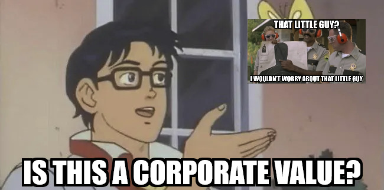
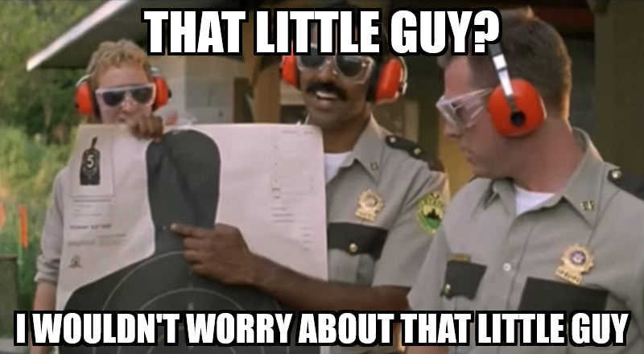
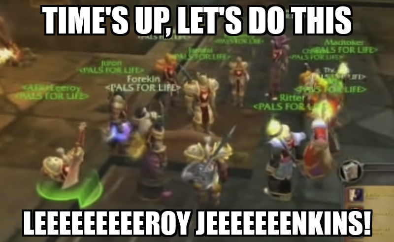
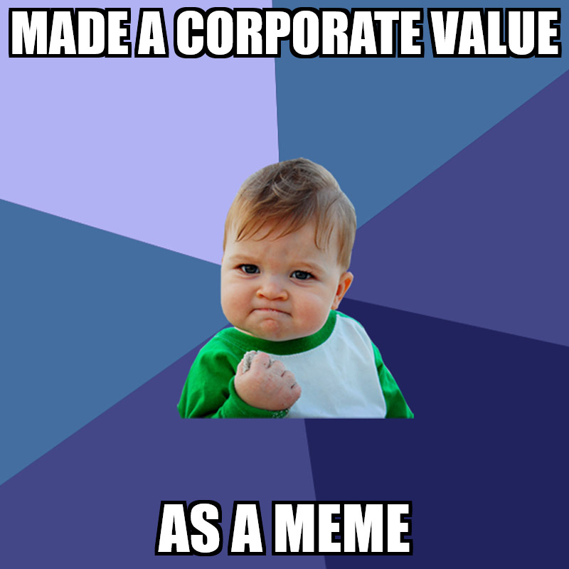

  

This is perhaps only my second, and hopefully final, time where I play futurist. I'm going to argue that memes are the future of corporate values. You know, those pithy, untruthful, and ignored statements that the senior leadership of your company claim defines their identity and culture. I want to replace them with the inane nonsense that you see across imgur, 9-gag, and icanhascheezburger. I'll show that this brave new world of corporate values as memes has clear benefits and should be embraced by providing real examples of how this amazing future could look. But first lets take a brief recap of the recent history of corporate values.

  

## Big Brother

George Orwell's 1984 covered a lot of ground while telling a beautifully tragic love story between Winston and Julia. Notably, the predicted horrors to fear are not limited to just those coming from national governments: the contradictory labelling of departments e.g. Ministry of Truth whose main function is to tell lies; the unconditional love that The Party demands of its followers for Big Brother; the demonstrations of togetherness and passion during the two minutes of hate. These dark patterns are all too common for industry veterans of the largest global corporations. Look at this [dystopian nightmare from Ernst & Young](https://www.youtube.com/watch?v=MaIq9o1H1yo).

  

The absolute horror behind the eyes of these young people thinking, "Is… is this normal? Are we all happy doing this, yeah?"

  

Along with the completely unnecessary shirt, ties, and high-heels, the environment is one of conformity, compliance, and corporate indenture. Memories and echoes of these tools and practices may linger in tech companies today, but the tropes were there for mocking for a long time. Office Space remains one of my favourite films of all time. I still own five suits but cannot remember the last time I wore any of them.

  

These employers had mission statements and corporate values, no different than any of today's big firms. The key difference then is that employee's opinions of them were less than ignored. It's not merely a case of having no input into them, it was part and parcel of industry servitude. You took a paycheck and you had some rules to adhere to.

  

As the world progressed beyond the idea of a job for life, employment liquidity became the norm and a shortage of engineers saw corporations compete on more than just salary.

  

"Come to work wearing a hoody, we literally don't care."  
"Sure, you can start at 10:30. So long as the work gets done we're happy."  
"Check out our new foosball table in the break-out room. Oh yeah, by the way, there's a break-out room."  
"We've got this company value: 'Don't be evil'."

  

## Modern Corporate Values

The ubiquity of the web means you're meant to know a thing or two about any company before attending your first interview. You best come prepared with how your own personal values align with the corporate values of your new potential employer. This is a clear improvement over the old system, and hints at a slightly more mature relationship that's closer to partnership than subordination. In the last two years I completed a company survey _that asked me_ for my opinion on how our corporate values might be added to or amended!

  

There is nothing new under the sun, however, and patterns repeat. Consider these two examples from Alphabet and Facebook:

  

Google: "You can make money without doing evil"  
Facebook: "Build social value"

  

Corporate values are an attempt to describe either what the culture is, what the culture should be, or both. As the two examples above clearly show, as soon as a company goes public, the board is interested in the next quarter being profitable, rather than adhering to the principles that got them to IPO. This has the effect of making companies wholly amoral. I'm not here to moralise on the amorality of business, but for the sake of accuracy each publicly traded company should probably append, "…as long as this helps maximise profitability" to the end of each of their values.

  

The problem is not limited to corporate values of old, echoing the ghosts of their bygone culture. Whatever company you work for, I challenge you to list all of your company's values right now without looking them up. I know my current employer's are literally six single words, but I could probably name only half. As pithy as they are, if they're not an outright fiction, there's a good chance they're still ignored. Here's a value from another company that likes single words:

  

Netflix: "Innovate"

  

We should innovate? Of course! There are nine more of those single words you need to consider when facing challenges at Netflix. At this point even if we still believed for a second that our employers considered our feelings when coming up with culture defining values, most don't do a good job at making them memorable enough to aid authentic decision making. The problem is the medium. It's no longer fit for purpose.

  

## Memes

Memes. They're a big part of how Millenials and Gen-Z communicate. If these generational cohorts are not the beating heart and head of global corporations right now, they will be within the next decade. Not only are memes ubiquitous as a form of communication, they're inherently understandable as a medium, and immensely engaging.

  

Your average employee is not going to write a new corporate value and email the CEO, "Hey Mike, what do you think about this?" Provide a few example memes that define or set the company culture, and employees will not only "get it", they'll add their own ones. Let's take a look at some examples of commonplace behaviours that modern tech companies might want to see from their employees.

  

### 1\. Trust, but verify

Great teamwork comes from trust, but trust doesn't come for free. It's built up over time. It also requires collaborating colleagues have a correctly understood shared lexicon. When you've been to battle with your teammates, you'll know what to expect from them when they say, "I'll complete X before end of day." or "I took care of Y and updated the sign-off sheet this morning." Until you have that unspoken understanding, verify and validate more explicitly when collaborating.

  

  

### 2\. Favour action over inaction

Ok, you got me. I just wanted to reference my favourite joke from Super Troopers. Let's try something using a more widely known meme that represents a company value of favouring action over inaction. When the path forward isn't clear, the company has decided it wants its employees to be brave and strike while the iron's hot. Just like our old friend Leeroy.

  

  

### 3\. State the uncomfortable truth

There are many situations where it's easy to let a lie pass the lips when the truth feels like it has many uncomfortable or dangerous consequences, but in the long run lying is a route to certain failure. Understand that individual bravery is required to look someone square in the eye and give them the plain truth, just like Michael should have done. Maybe he might have kept his job.

  

  

## Don't Take Yourself Too Seriously

It's clear I'm not going to win many fake internet points on imgur.com for my isoteric meme making skills. There is a serious point to this subject though. It is happening again, the cyclical apathy of employees in large companies that were once bright and innovative organisations encouraging critical thinking and outspokeness. Maybe it's always been this way. A tool that allows employees to stop their employers from taking themselves so seriously, even temporarily, is a tool that's worth fostering.

  

If the eyes of the new Ernst & Young recruits said one thing alone, it was, "I have no voice." Memes are a much more fluid medium that employees will pick up and run with when it's clear that the culture of the company has changed for the worse. As with all crazy innovations like this, it only seems crazy because it hasn't been done yet, and I concede in certain places it never will. Amazon is never going to replace "Have backbone; disagree and commit" with a meme of Cartman offering to, "Roshambo you for it".

  

Startups are crazy too though. Startups can do things differently sometimes just to see how they work out. If you're a CEO and you're hiring your first employees, don't boil down the essence of your fledgling company culture by creating a new doc in the wiki for "corporate values". Instead head to an [online meme maker](https://memebetter.com/) and go nuts so you can say...

  

