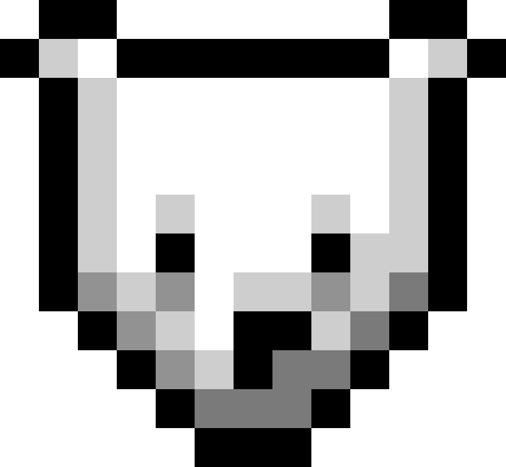
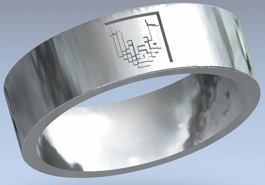
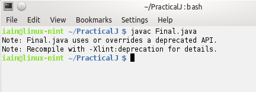
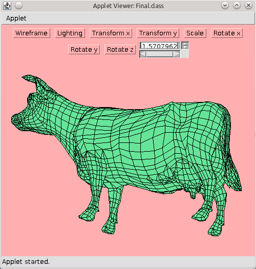
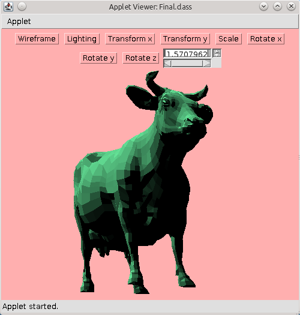
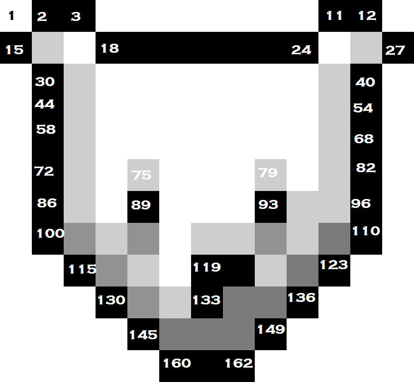
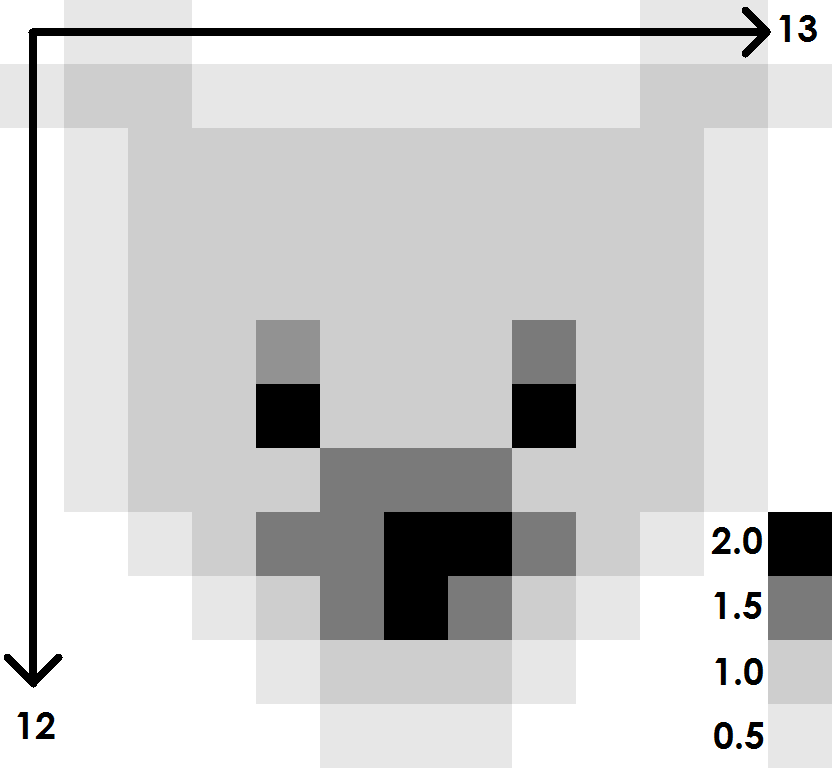
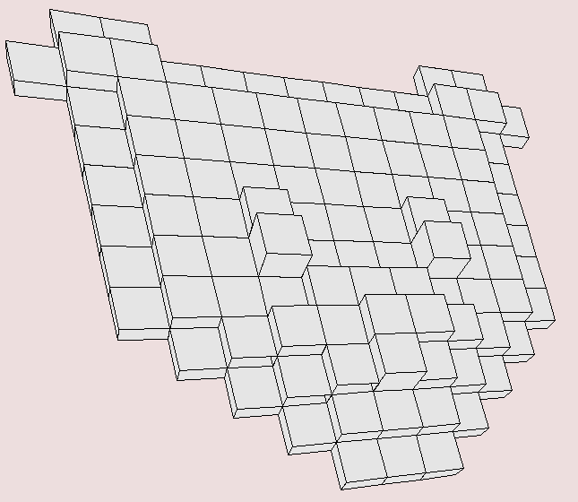
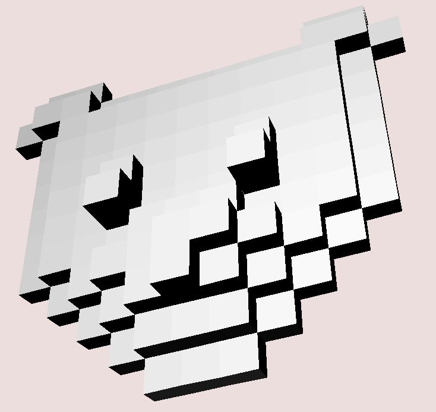

So often when faced with a programming task, you never truly solve the required problem from scratch. To be completely pedantic you're not writing processor instructions or even assembler but rather high level programming commands that are compiled or interpreted depending on your language choice. But with more and more tools available today to make the job easier, a lot of the necessary knowledge and skills aren't so much about how to programmatically break down and solve problems - it's just as much about knowing how to use all the tools out there.

I love it when I've developed with a new technology enough so I "get it". That feeling is fantastic when it clicks and you understand what it's there for, how it should be used etc. And like my recent lightbulb moment with jQuery it feels great, but unless you continue to use your skills it's easy to forget everything you learned. That's why I keep a good track of my sourcecode when I'm done - something even easier to do these days with GitHub and [Gists](https://gist.github.com/) - because it's the first port of call when I need to revisit a platform I'm not an expert in.

But how far back is it sensible to go? When should we say, that was interesting and fun but it's no longer the right way to solve a problem - I should drop that code and learn a new way of doing things if the same problem occurs again. And where does the trade-off sit between performing a task once in a sub-optimal fashion and knowing the best practice method to solve the task multiple times?

This idea came to the fore for me recently when I was presented with a real life problem that I thought I might be able to solve with some coding... but it involved resurrecting Java 1.2 code I wrote as a 19 year old undergraduate student. Read on and make a mental note of when you would have put the keyboard down and said, "No, that's crazy."

## I'm getting married

First thing's first: I'm getting married. This means I'm about to get my first, and likely only, piece of jewellery ever. I therefore feel it's important to get it personalised to some degree, something that will make me happy everytime I look at it. Without going into too much detail, I'm having a few different symbols engraved on the ring one of which is an image from a website. It's a tiny bit of polar bear pixel art.

I gave some vague instuctions to my designer along the lines of, "I'd like it to look like some kind of three dimensional tiled thing." Of all the elements I described, I was least clear about what I wanted or indeed what to expect in return. A week later I find a series of images attached to an email in my inbox. Here is the 3d tiled polar bear.

My first impression was, "That doesn't look like the polar bear." I went back to the original pixel art and had a detailed look. The problem is that even though there are only four colours, they represent shade in some parts and lines in others. The only tool a 3d modeller has is depth. I started thinking about how I'd draw or make a physical 3d model before realising it would take far too long to do and I had no idea where to start.

And then I had a crazy thought. One of my courses at university was in computer graphics. It was largely theoretical and we didn't learn anything about using industry specific tools but rather the mathematics underlying [fractals](http://lifebeyondfife.com/87-beauty.html/ "Sierpinski Fractal example"), matrix operations on 3d models, shading and light sources etc. I had the sourcecode to the final three years of all my computer science practical assignments - I remembered I wrote a functioning 3d rendering engine that took a plaintext file format for 3d objects. It targetted an early version of the JVM but it didn't use anything too complicated, just drawing 2d polygons. "Could I resurrect that sourcecode and create a model of the polar bear _myself_?", I wondered.

## I wrote that!?

The second thought through my head after the craziness of what I was about to do was, "Is there a better way to do this?" For instance, I could have looked into using a 3d design tool, I could have looked into using a new and purpose built 3d rendering engine. But I countered these arguments with how often I was likely to perform such a task again - probably never. This method gave me a safe feeling that I was falling back on old code that I had complete control over. Very quickly I drew up a list of tasks I'd need to perform in order to create a 3d model of the pixel art polar bear favicon.

- Find code
- Recompile code
- Study and understand input file format
- Write code to create new input file
- ...
- Profit?

I didn't think the first two would present much trouble, and from what I recalled about the file format it was fairly straightforward. The creation of the new input file was the one point I wasn't too sure about but considering how small the number of pixels (tiles) was, it didn't overly concern me. I decided to give myself an hour to see how far I could get before deciding whether to plough on, or trash the idea and think of something else.

##### 1\. Find Code

I went to my backup files and within a few minutes I had found PracticalJ and a set of files called cow.dat and heli.dat. Aaaah yes, the 3d cow - it was all coming back to me. The next thing to hit me were the filenames: First.java, Second.java, Nearly.java and Final.java. I sighed. The year was 1999 and available source control systems such as CVS were not yet on my radar. It would only get worse.

##### 2\. Recompile Code

With only some deprecation warnings, the 13 year old system seemed to be in working order still. I direct appletviewer to the index.html file in the same directory and am faced with a sight I haven't seen in a long time.

And after messing around rotating it into position and turning on the shaded model.

Before I start ripping into my over a decade old code I should start with a little Woo Yay Houpla ;) that it works at all. Woo Yay!

That being said, three things strike me about the executable and the code upon first inspection. Firstly, what is it with my desire to hurt the eyes? Lime green on pink!? Secondly, even though the practical assignment specifically asked for an interface that could independently transform i.e. move, scale i.e. increase/decrease the size, and rotate in each axis, my user interface is painfully unusable. The same text box acts as input for all model manipulation buttons. Observant readers will note that I've populated the text box with ( frac{pi}{2} ) by default so that clicking on any of the rotate buttons give the user a (frac{1}{4}) revolution - that's about as helpful as my teenage self got for the user.

The final issue I'm struck by is the most worrying and it concerns the quality of the code. All the code (which contains just three classes) is in one file and it's amazing at how worrying the inconsistencies are and how desperately in need it is of a major refactoring. Duplicated constant numbers litter the file; patterns that could be extracted out into their own function are repeated again and again; public access is granted to classes internal data structures in lieu of a sensible API; mail sort has been implemented (badly) from scratch rather than using an internal library because I'd recently independently discovered the algorithm and thought it was fantastic; and the most heinous crime of all, variable names give no indication as to their intention. Part of me doesn't want to judge the last point too harshly owing to the fact that I started using long, descriptive variable and method names only after I had an IDE to autocomplete them for me. But looking back now I'm still staggered at how bad the code is.

The initial idea was just to get the code up and running and make a new input file. I could see a polish to the UI would be in order as well. With a slightly heavier heart I press on to the next task...

##### 3\. File Format

As I recalled, it was a reasonably simple format. The first line records the number of points in 3d space, and the number of polygons used to model the shape. Each 3d co-ordinate point is represented by three numbers, one for each x, y and z cartesian axis value. The order of the points acts as an index which the polygons use. A polygon is described by the number of points it has e.g. three for a triangle, followed by the indices of the points.

`{number of points} {number of polygons} 0 0 0 0 0 0 x1 y1 z1 x2 y2 z2 ... 4 p1 p2 p3 p4 3 p2 p3 p6`

##### 4\. Producing a 3d model

I could see two distinct problems: specifying the points in 3d space and then creating polygons made out of those points. I had a piece of pixel art (13 times 12 ) in size with four depths which I created with a triple nested for loop.

var coordinates = new List< string >();
for (var k = 0d; k < = 2d; k += 0.05d)
    for (var j = -0.6d; j <= 0.6d; j += 0.1d)
        for (var i = -6.5d; i <= 6.5d; i += 0.1d)
            coordinates.Add(string.Format("{0} {1} {2}", i, j, k));

The next step was a bit harder. Before deciding what the depth of each tile should be, I needed a way to go from one point to drawing the top and four sides. This was done by denoting a depth to the top left point of each tile and creating 5 polygons e.g. for point (x) and (y = x - 182):

`4 x (x+1) (x+15) (x+14) 4 (x+1) x y (y+1) 4 x (x+14) (y+14) y 4 (x+14) (x+15) (y+15) (y+14) 4 (x+15) (x+1) (y+1) (y+15)`

This was made possible by observing the numbering of the co-ordinates and deciding later which depth the point should be at.

var points = new Dictionary< int, int >();

var depthOne = new \[\] { 2, 3, 11, 12, 15, 18, /\* ... \*/ };
foreach (var i in depthOne )
    points\[i\] = 1;

var depthTwo = new \[\] { 32, 33, 34, 35, 36, 37 /\* ... \*/ };
foreach (var i in depthTwo)
    points\[i\] = 2;

var depthThree = new \[\] { 75, 79, 104, 105, 106, /\* ... \*/ };
foreach (var i in depthThree)
    points\[i\] = 3;

var depthFour = new \[\] { 89, 93, 119, 120, 133 };
foreach (var i in depthFour)
    points\[i\] = 4;

Before long I had a file representing a reworking of the 3d model that shaped the nose to be sticking out and the face and ears raised only slightly at the sides.

`910 536 0 0 0 0 0 0 -0.65 -0.6 0 -0.55 -0.6 0 -0.45 -0.6 0 -0.35 -0.6 0 <...902 3d co-ordinates later...> 0.35 0.6 0.2 0.45 0.6 0.2 0.55 0.6 0.2 0.65 0.6 0.2 4 199 198 184 185 4 198 16 2 184 4 199 17 16 198 <...531 polygons later...> 4 822 458 472 836 4 821 457 458 822`

##### 5\. Profit?

After much deliberation and tile depth consideration, I was happy I'd come up with the reasonable 3d model shown above. I also tidied up the UI making the rotate actions triggered by mouse drags, and zooming in and out (scaling) triggered by the mouse wheel. Finally, I removed the confusing two buttons that represented three available states in favour of a radio button. I was suprised at how easy it was to modify considering I hadn't programmed in Java for ten years - despite all the [security flaws](http://www.huffingtonpost.com/2013/01/13/java-security-problem_n_2464656.html) and [Ask toolbar shenanigans](https://www.change.org/petitions/oracle-corporation-stop-bundling-ask-toolbar-with-the-java-installer), I still have a soft spot for the heavy lifting the JVM framework does for the programmer. If you're happy running Applets in your browser, here is what I hope to have on the ring finger of my left hand:

[3d Polar Bear](http://lifebeyondfife.com/applets/PolarBear/)

## Time well spent?

I greatly enjoyed my trip down memory lane in spite of discovering that my programming from years ago, even when it achieved something encouraging, was lacking in coherence and good style. I was tempted to hide it away in shame but instead I'm going to add it to [my GitHub repository](https://github.com/lifebeyondfife/BadGraphicsLibrary/) as usual and think about the positives of how much better my coding has become over the past decade.

There was something enjoyable about looking at my old code. But mainly there was something intellectually safe to it. Would it really have been too much effort to recreate the parsing of a file of data points and rendering in a proper 3d engine like say [three.js](https://github.com/mrdoob/three.js)? One that renders in real-time without flickering or clipping problems? The process may well have taken a little longer and frustrated a little more but the rewards would have been much greater. I may only ever need to create a polar bear wedding ring model just once in my life but knowing how to do 3d coding in a HTML5 canvas, say, would have helped me in other ways. I could have implemented one of my [older ideas previously shelved](http://lifebeyondfife.com/81-real-games-html/ "Old Idea") for a rainy day.

I'll think much more closely next time I dust off some previous library code to a similar problem already solved. At what point would _you_ have walked away and said, "No, this is crazy. There's a better way."? Or would you have guiltily revelled in the fun like I did? Share your views in the comments section below or [send me a tweet](https://twitter.com/LifeBeyondFife/). It's the only way I'll learn.
