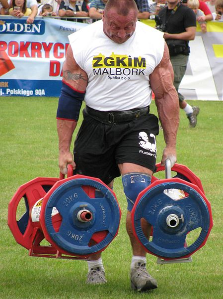
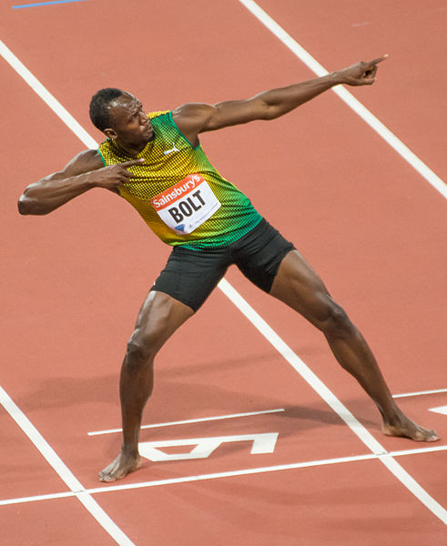
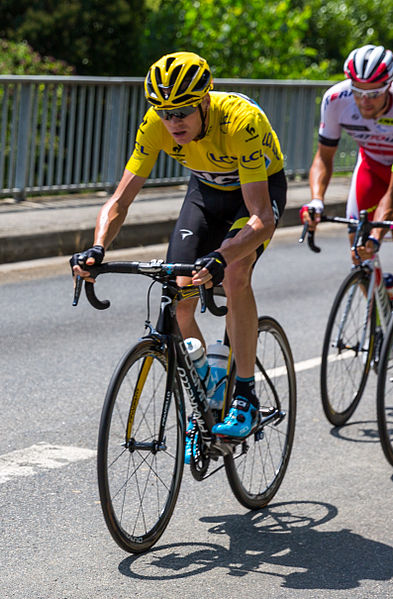

Fitness means different things to different people. Fitness means different things to different sports. The physical capabilities of humans are breathtaking in terms of the kind of achievements that are possible. For running, humans have completed 100m in under 10 seconds, one mile in under 4 minutes, a marathon in under 2 hours. Polar explorers, mountaineers, free divers etc. survive inspite of deadly conditions to reach famous global boundaries. Various other disciplines see fellow humans throw, jump, kick, and lift more and further than we've ever seen.

  

The world's best in one category could be a rank amateur in another though. Eddie Hall was the [first man ever to deadlift 500kg](https://www.youtube.com/watch?v=T9Y4o_BqC0A), literally a nosebleed inducing feat. But I'll bet any money on me finishing 800m faster than him. If you train for a sport then there are specific exercises for which you should optimise your training routine. Looking at the extremes of athletes who are the limits of what's physically possible is not what the average person should consider — we're not here to devote our lives in the way the professional athletes are.

  

Many of us won't have a single sport to focus on. The motivation may be several sports, or even no sport at all. You might just want to feel good, be healthy, look in shape, be able to go for a long walk, move that heavy cabinet, quickly fly up several flights of stairs without getting out of breath. Regardless of how specific your fitness requirements may be, it's important to understand the primary fitness types.

  

### The three types of fitness

- Strength
- Power
- Endurance

  

The above categories can be thought of as points on a spectrum with endless divisions between. I will describe each of the three types using standout examples who have optimised to an extreme degree in each.

  

## Strength

Mariusz Pudzianowski, photo by [Artur Andrezj](https://commons.wikimedia.org/wiki/File:Mariusz_Pudzianowski_7.JPG)

Mariusz Pudzianowski is a Polish strongman who won the World's Strongest Man competition a record 5 times. Strength is about moving, or maintaining the position of mass: the bigger the better. Strength exercises in competitions might be lifting a car chassis, pulling a truck/aeroplane, throwing barrels over a great height, or the infamous Atlas stones. But the fundamentals of weightlifting are apparent, even in these entertaining strongman competitions. The three core compound lifts are the basis of strength: the deadlift, the bench press, and the squat (more detail on these later). All of these lifts require an olympic barbell or similar, which is usually a 20kg, 7ft long metal bar to which several weighted plates are attached at both end. Other compound lifts and ancilliary movements encompass the fitness type of strength which involve a full extended movement of the body with resistance applied by increasing large weights.

  

An exercise to train for Strength will constrain time (roughly between 30 seconds and 2 minutes), limit distance of travel (mostly an exercise will require the participant to remain in one place, but will likely not travel further than 100m), and focus on maximising the associated weight. For example, a strength exercise could be, "What's the heaviest weight you can pick up and carry 50m?"

  

The first thing to give out in a test of strength are the body's muscles: you will ask the body to do something its muscles or frame simply cannot do.

  

## Power

Usain Bolt, photo by [J. Brichto](https://en.wikipedia.org/wiki/File:Usain_Bolt,_Anniversary_Games,_London_2013.jpg)

Usain Bolt is the world record holder of the 100m and 200m sprint. Power is about explosive movement. Like strength, power is about shifting large weight, but here the balance is not just about how much you can move, but also how fast you can move it. Similar to weightlifting, a barbell is the fundamental equipment used in powerlifting. Unlike weightlifting, where the movements are a straightforward singular motion, powerlifts usually have multiple component parts e.g. a clean and press lift is where a barbell laden with weight plates is 'cleaned' from a stationary position on the ground up to the lifter's shoulders; from here the barbell is 'pressed' into the air above the lifter's head. Fast, explosive movements are required to give momentum to power exercises.

  

An exercise to train for Power will limit distance of travel (perhaps the length of a sports field for football or rugby, or else travel no further than a few hundred metres), and focus on maximising some combination of weight and speed. For example, a power exercise could be, "What's the fastest you can run 100m?" An alernative with a weight optimisation could be, "What's the heaviest weight you can power snatch?"

  

The first thing to give out in a test of power are the body's lungs: you will ask the body to maintain a level of activity that demands more oxygen in the blood than you're capable of maintaining.

  

## Endurance

Chris Froome, photo by [Gyrostat](https://commons.wikimedia.org/wiki/File:Chris_Froome,_TDF_2015,_%C3%A9tape_13,_Montgiscard.jpg)

Chris Froome is a road cyclist, and four time winner of the Tour de France, as well as winner of Giro d'Italia, and the Vuelta a España. Endurance, synonymous with stamina, is about how long or far can you work at a level below your maximum capabilities. If strength exercises are all over in less than a minute, power exercises over in a minute or two, endurance exercises go on for hours. Indeed, this is the skill in the animal kingdom where humans excel above all others. Whereas humans are pitiful contestants in feats of strength compared with other primates like gorillas, or displays of power compared to big cats like lions, humans can travel distances that no other land animal can.

  

An exercise to train for Endurance will usually have no, or little, weight element to it, but will most likely set a target distance to achieve that will take several hours to complete. In addition to the famous road cycling competitions above, there are 10ks, marathons, and ironman races.

  

The first thing to give out in a test of endurance is the body's fuel store: you will ask the body to do something when you're "running on fumes". An honourable mention must also go to mentally giving up. This could be the reason the human body accepts defeat for any of the above exercises but it's particularly acute with regard to endurance exercises given how long they, quite literally, endure for.

  

## Fitness types and training

Training will make you fit. Training is structured exercise. How you exercise will optimise you toward a certain type of fitness. Or, without conscious thought, you could train for different types of fitness and achieve none of them i.e. you cannot maximise your ability to deadlift at the same time as preparing to run a marathon. Becoming fit will need you to consider how you exercise, and create a training programme that works toward achieving a valid fitness outcome somewhere on the strength-power-endurance spectrum. Now you understand the different types of fitness, we'll next look at how the body has an engine primed for each of these fitness types, and we can change what that engine is capable of.

  

[/fitness](https://lifebeyondfife.com/fitness)
