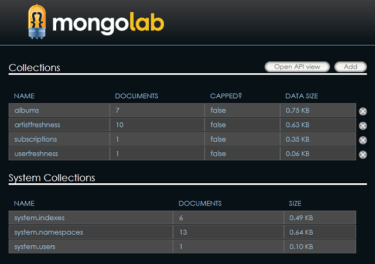
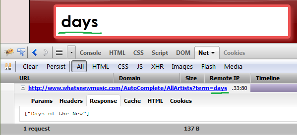
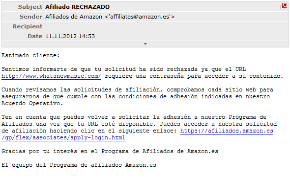
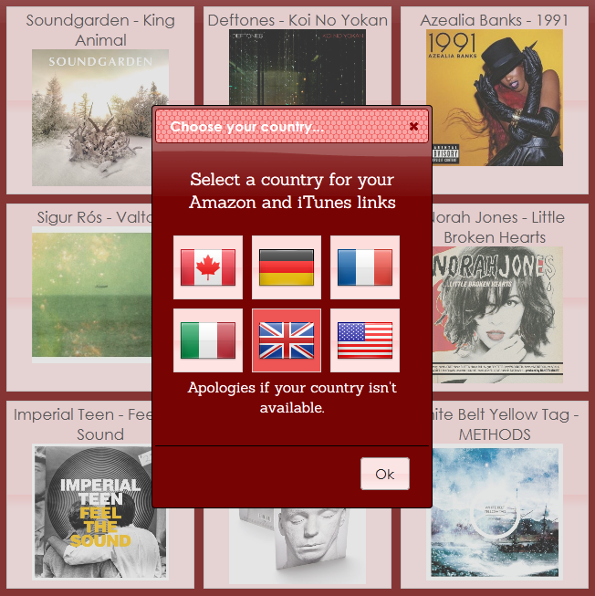
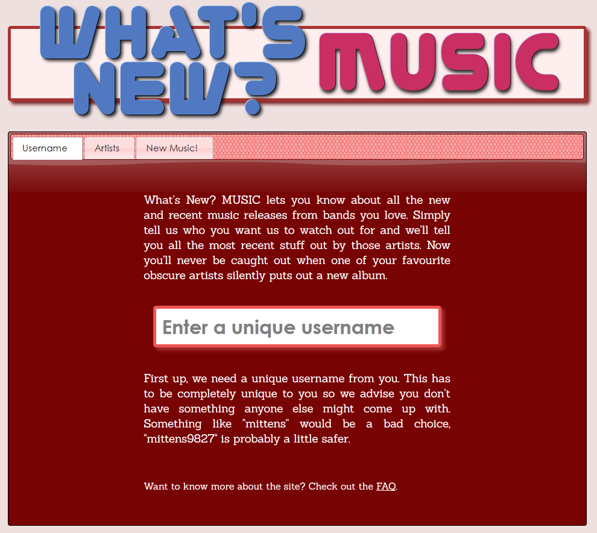
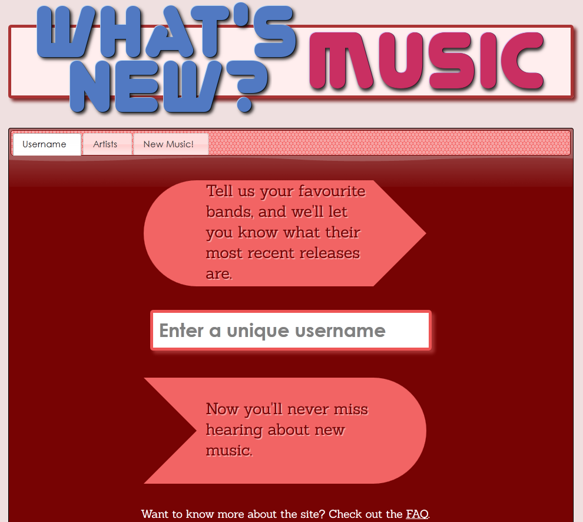
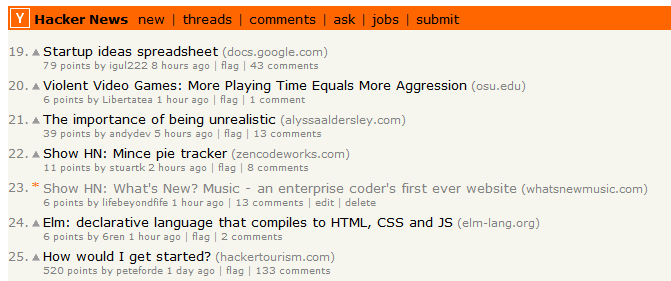
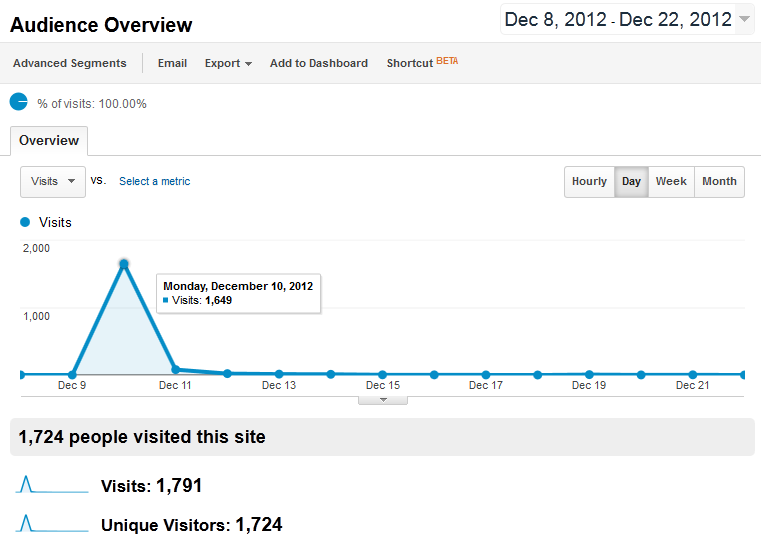

[What's New? MUSIC](http://whatsnewmusic.com/) was recently launched, so for those of you who've already read about the idea, architecture and technology stack, you can go straight to the [post-launch results and conclusions](http://lifebeyondfife.com/from-idea-to-launch-a-website-dissection/#postlaunch). For everyone else though...

At the beginning of the year I posed a [conundrum on Twitter](https://twitter.com/LifeBeyondFife/status/167536293658624000). I wanted some way to make sure I never missed out on a new release by one of the many bands I like. In the end, I had to build it myself. This would be my first website ever after a professional lifetime of enterprise code and it started something that would take up a large part of my free time for the next 9 months. I created and launched the website [What's New? MUSIC](http://whatsnewmusic.com). Here is my journey.

_The tweet - which no-one replied to - that started it all_

## The Idea

I like lots of different bands in lots of different genres. Though music is important to me, I don't have the time nor inclination to constantly be checking all those bands for potential new releases. What I needed was a service that could be told what I like and then it would tell me the most recent albums released by all those artists. I realised that this was definitely a website idea rather than a Windows .exe which I'd usually develop.

This presented two distinct problems. Firstly, I didn't know much JavaScript, my HTML and CSS weren't exactly world class and I hadn't written any web server code in my life. But more than that was problem number two. I can knock out some C# code in Visual Studio without much fuss. I know how to design user interfaces and can even create an installer, associate filetypes etc. And all of that is free, I can make my implementation as throwaway as I like. But a website? I have to register a domain, I have to pay for hosting servers and databases. Even though my idea is a small one, these details mean I need the execution to be more thought out and complete.

All those years of casually dismissing web development as trivial because I know how to do pointer arithmetic has come back to bite me in my arrogant ass.

## The Technology

It's pertinent to point out now that the picture I'm about to paint over several different sections is the final, hindsight view. Whether decisions were made early and strictly adhered to or whether I flip-flopped and rebuilt on the back of an envelope two days ago, I'll describe the finished site and the thinking behind each choice made. Here are the technologies I used to build What's New? MUSIC.

- [MongoDB](http://www.mongodb.org/) - a NoSQL database
- [WCF REST Service](http://msdn.microsoft.com/en-us/magazine/dd315413.aspx) (+[Microsoft Enterprise Library Cache](http://msdn.microsoft.com/en-us/library/ff647280.aspx))
- [ASP.Net MVC 4](http://www.asp.net/mvc/mvc4) (+[Razor](http://weblogs.asp.net/scottgu/archive/2010/07/02/introducing-razor.aspx))
- [jQuery](http://jquery.com/) - for [AJAX](http://en.wikipedia.org/wiki/Ajax_%28programming%29) web requests
- [jQueryUI](http://jqueryui.com/)
- [Firebug](https://getfirebug.com/) - for client-side debugging

The MongoDB database platform was chosen for a few reasons. Firstly, I was curious as to how NoSQL worked in practice. I had a fairly good idea of the data operations required and none were particularly complex or required crosstable lookups. Also, MongoDB allows a relatively straightforward interaction with .Net and LINQ. The clincher though was [MongoLab](http://tinyurl.com/mv2sdt)'s offer for [free cloud based hosting](https://mongolab.com/signup/) for databases less than 500Mb in size.

As I alluded to previously I hoped to ease the transition to this foreign development landscape by using whatever existing knowledge I had. For me, that means Microsoft's tools, .Net and more specifically C#. I planned to follow an SOA design as much as possible (more on the exact details later) and my first step on this plan was to use Microsoft's web template for a [WCF REST service](http://visualstudiogallery.msdn.microsoft.com/fbc7e5c1-a0d2-41bd-9d7b-e54c845394cd). It was a while ago when this project started and the advice I've seen tends to suggest that ASP.Net MVC should be used for pure REST services now as well as web frontends.

Speaking of which, the web frontend is rendered by an ASP.Net MVC 4 server. This is Microsoft's take on Ruby on Rails with lots of convention over configuration. Thank you Microsoft, you finally got it. A Scott Hanselman [introduction to ASP.Net MVC video](http://channel9.msdn.com/Events/DevDays/DevDays-2011-Netherlands/Devdays002) got me going and I agree with him, the MVC triangle diagram doesn't really help any. The product though is fantastic as is that video.

The final technologies related to JavaScript were ones I waded into rather blindly to be honest. I knew I wanted a nice looking, modern responsive web UI but didn't really have a clue how to go about making one. My only previous JavaScript experience was my [HTML5 Sierpinski's Triangle](http://www.lifebeyondfife.com/87-beauty.html) demo – though exceedingly cool, it's not anything that would really help me with UI creation. I'd heard about jQueryUI and the components that it could produce and I knew that jQuery was a popular JavaScript library in the web space, but I didn't really know what it should be used for or what it could accomplish or how. I have since used jQuery extensively for AJAX requests and tailored jQueryUI elements to get the look and feel I wanted. All the while using Firebug to debug client-side scripts. As I look back now with a much better grasp of jQuery – not just what it's about but also how to solve problems with it – I think, for me at least, learning this technology was the biggest win throughout this whole process.

## The Architecture

Coming from a desktop background, some recalibration is required with regard to how division of code is managed. It's important to stop thinking in terms of classes and assemblies (.DLLs) and start thinking in terms of web services and data flow. Without trying to learn verbatim everything about Service Oriented Architecture and RESTful interfaces, I started with just a few rules that seemed most integral to me.

- Create web services that are stateless
- Use JSON (or at least XML) for internal communication
- Cache anything that makes sense
- Obey the http request type rules e.g. GET doesn't change state, PUT is idempotent, each request does just one thing etc.

From here an architecture evolved that allowed me to solve the initial problem and provide a sane abstraction for each task. Click for an enlarged version.

The central WCF REST service server would allow five types of http request.

- GET /{username}/Artists – return a user's subscribed artists list
- GET /{username} – return a user's latest releases by subscribed artists list
- PUT /{username}/{artist} – add an artist to a user's subscribed artists list
- DELETE /{username}/{artist} – remove an artist from a user's subscribed artists list
- GET /AllArtists – return the list of all artists subscribed to by all users

I was pleased by how minimal the interface was in the end. This central server would send out requests to music databases and store the results in a local [Enterprise Library](http://msdn.microsoft.com/en-us/library/ff648951.aspx) cache - although, Microsoft now advise you use the [System.Runtime.Caching](http://msdn.microsoft.com/en-us/library/system.runtime.caching.aspx) namespace - and also persist updates to the NoSQL database. The NoSQL database schema is recreated as a set of data contracts in this server and the MongoDB .Net libraries connect directly to the database in MongoLab's cloud. More about the specifics of this subset of the whole architecture were covered in a [blog post from earlier this year](http://www.lifebeyondfife.com/90-new-music-part-one.html). The exact nature of the music data requests to follow.

_An example MongoDB record and the C# class it binds to_

_A freshly created MongoDB in the cloud served by [MongoLab](http://mongolab.com/)_

The ASP.Net web frontend communicates with the user directly and uses client-side scripting to render the UI and make AJAX requests via jQuery that are translated to calls to the central WCF REST Service which in turn provides lists of artist and album data structures in JSON.

_Example of WCF binding to a RESTful http API_

I'll not go into too much detail about how MVC works in general but I will briefly describe how this site uses it. Requests from a client browser map to specific code entry points in the Controller with http GET variables passed through as parameters. The specific Controller code communicates with the Model to get the artist or album specific data and uses dynamic functionality now available in .Net to create a property bag. This dynamically typed object is passed to the View where a skeleton HTML file and some final code structures are combined using [Razor](http://www.microsoft.com/web/category/razor) to produce the HTML, CSS and JavaScript that's sent back to the client's browser.

_Now MVC's RESTful binding. This is one of the Controllers._

_And this is a View. The syntax is mostly pure HTML with unobtrusive Razor coding constructs here and there (Visual Studio formats it like that though \*shakes head\*)._

The web server also maintains a list of all the artists subscribed to by all the users to provide autocomplete functionality for the Add Artist textbox – again a piece of jQuery AJAX functionality. Both the WCF and ASP.Net MVC servers are hosted in [Microsoft's Azure](https://www.windowsazure.com/) cloud platform. This was my first experience with cloud computing and after a couple of small teething problems, I was up and running with their free [3 month trial](http://www.microsoft.com/web/category/razor).

_The client side JavaScript jQuery code to produce AJAX autocomplete functionality for a text box_

_Monitoring the AJAX web request and result using [Firebug](https://getfirebug.com/) in Firefox_

And in addition to just monitoring traffic with Firebug, I could set breakpoints and query the stack in realtime (click for full size).

Here is where I introduce (hopefully) my first bit of sub-par, non best practice web development. There is no test database, only production. I can run the web server instances locally but whether on my laptop or in the Azure cloud, they both connect to MongoLab's cloud. I know from my time working in enterprise land this is A BAD THING. But the database schema has remained fixed since its inception so I'm allowing this to slide for now at least. The other part that doesn't quite feel right is deployment. I maintain source control for the WCF REST service server and ASP.Net MVC web server via a couple of projects in one Visual Studio solution – which I manage in SVN locally and backup regularly. The way it's published is on a per project basis from a menu item in Visual Studio. A couple of clicks and I've updated the source code on my cloud instance and the service is instantly restarted. My enterprise coding self would prefer the ability to rollback or at least have some other kind of  safety net to this process.

## The Data

Those of you who read the [earlier blog post](http://www.lifebeyondfife.com/90-new-music-part-one.html) will have seen me getting my artist and album data from the [MusicBrainz](http://musicbrainz.org/) open database. However, they required polling to their database to be queued at one request per second\* and this was too much latency to add to the service and still retain the attention of potential users. So I switched to a combination of polling both Amazon and Apple's databases for artist and album information, but also for their respective purchase links.

[Apple's API](http://www.apple.com/itunes/affiliates/resources/documentation/itunes-store-web-service-search-api.html) was an absolute delight. One query to find the artist, one to find their releases. All done via http GET requests and data returned as JSON. Exactly how an interface should be done.

I have only bad things to say about Amazon in this respect though. Constructing a working query requires the procurement of a developer key before you can get started but that isn't the half of it. That the request is more complicated than Apple's is fair enough to a certain degree, Amazon sell a lot more different things than Apple do. But that just means the onus is on Amazon to provide better documentation and examples. The entire documentation is on one page for Apple but it's a [complete mess](http://docs.amazonwebservices.com/AWSECommerceService/latest/DG/CHAP_MakingRequestsandUnderstandingResponses.html) for Amazon. The most frustrating part of the process is an expectation to produce an exact hash using complicated instructions, with no way to verify what a working version should be other than the [solitary example on this page](http://docs.amazonwebservices.com/AWSECommerceService/latest/DG/rest-signature.html). This one drove me nuts. Fields have to be sorted in a case-specific ordering; characters have to be URL encoded (and not by the standard .Net library method), the http GET request has to be sliced at certain points to construct the hash and glued back together again afterwards with extra fields. And after all that, Amazon return a deeply nested XML document which is overkill compared to Apple's straight to the point JSON (again though, Amazon do sell more different things than Apple). I've vented enough so I'll close my rant by stating I was _very_ happy when I finally managed to get [Amazon database lookups working](https://twitter.com/LifeBeyondFife/status/252124534235340801).

\*small aside: the teething problems I had with Microsoft's Azure cloud trial were related to how I solved the one request per second polling. I created a queue of requests for MusicBrainz and a separate thread that would process them at a rate of one per second. This second thread ran indefinitely even when there were no requests. Fine when it was on my laptop. On the cloud, however, I breached free use limits in less than an hour.

## The Questionable Colour Scheme

There is certainly a bit of skill and thought required in making a desktop user interface. Buttons, sliders, textboxes, toolbars, labels etc. they all have to be positioned sensibly and aid the user in specifying the necesary inputs as easily as possible. Though the same principles apply to websites - let the user get in and out easily, without confusion - the tools available are very different. The potential layout is more freeform, there's a stronger need for graphics and the site as a whole needs to have a consistent look and feel. Which is where jQueryUI is so helpful.

For those who haven't seen this before, jQueryUI provides many [additional controls](http://jqueryui.com/demos/) beyond those in the standard HTML variants. But more than that it helps you [choose your own fonts, colours, backgrounds](http://jqueryui.com/themeroller/) and a whole lot more. However, it's much harder to come up with something that doesn't look like an [explosion in a paint factory](http://jqueryui.com/themeroller/#ffDefault=Serif&fwDefault=bold&fsDefault=2.0em&cornerRadius=14px&bgColorHeader=feff57&bgTextureHeader=16_diagonal_maze.png&bgImgOpacityHeader=75&borderColorHeader=ec04d0&fcHeader=17cad9&iconColorHeader=1ff702&bgColorContent=9c0d0d&bgTextureContent=19_layered_circles.png&bgImgOpacityContent=75&borderColorContent=f0670a&fcContent=ebfb32&iconColorContent=f718f1&bgColorDefault=3ee92b&bgTextureDefault=22_spotlight.png&bgImgOpacityDefault=75&borderColorDefault=ff00de&fcDefault=fdfcfc&iconColorDefault=132eec&bgColorHover=964a4a&bgTextureHover=20_3D_boxes.png&bgImgOpacityHover=75&borderColorHover=999999&fcHover=212121&iconColorHover=454545&bgColorActive=ffffff&bgTextureActive=08_diagonals_thick.png&bgImgOpacityActive=65&borderColorActive=aaaaaa&fcActive=212121&iconColorActive=454545&bgColorHighlight=fbf9ee&bgTextureHighlight=17_diamond_ripple.png&bgImgOpacityHighlight=55&borderColorHighlight=fcefa1&fcHighlight=363636&iconColorHighlight=2e83ff&bgColorError=ce430d&bgTextureError=21_glow_ball.png&bgImgOpacityError=95&borderColorError=9c0acd&fcError=fdfd96&iconColorError=3f3127&bgColorOverlay=aaaaaa&bgTextureOverlay=14_loop.png&bgImgOpacityOverlay=0&opacityOverlay=30&bgColorShadow=9cff70&bgTextureShadow=08_diagonals_thick.png&bgImgOpacityShadow=0&opacityShadow=30&thicknessShadow=8px&offsetTopShadow=-8px&offsetLeftShadow=-8px&cornerRadiusShadow=8px) than you'd imagine (I recommend you look at that last link for the pure shock/entertainment of it, although I must warn you, "Ze goggles, they do nothing!"). I can't remember exactly why I leaned towards a salmon, pink and red colour scheme - perhaps I'd just been looking at last.fm - but it's one that I felt was original and easy enough on the eye.

## The Delays

In this write-up of my progress it seems like I went through things with relative ease. This is far from the case. Even in dealing with complicated software development problems, when you're in a familiar domain progress is usually, if not constant, then at least progressive. Without knowing the equivalent design patterns and correct way to handle unit tests, continuous integration and deployment etc. seemingly trivial problems can quickly turn into complete deadends. For a seasoned developer this is a humbling experience to have to go through but it's no reason to feel ashamed. I was just thankful that despite not having access to university lecturers or web developer colleagues, there's always StackOverflow (thank you [Mark](http://stackoverflow.com/questions/10895518), thank you [Bart](http://stackoverflow.com/questions/13031319), and thank you [Joel](http://www.joelonsoftware.com/) and [Jeff](http://www.codinghorror.com/) as well I suppose).

## The Business Model

Though this is a web service I personally want and can't see filled anywhere, though this is an exercise primarily in learning, there are still server costs so I would be foolish not to consider a business model for the site. I've always had a problem with advertising, indeed I've forgotten what the web actually looks like after years of using Adblock Plus and NoScript. But affiliate links seemed like a sensible way to profit from traffic. When displaying links to new albums I provide specially crafted URLs that make a commission for purchases at Amazon or iTunes.

This is yet another thing that's time consuming and in all honesty a little more complicated than it needs to be. First off, Amazon require you to register for each separate territory and use a different site id. Registering for the UK and North American ones were easy enough. However, the European ones are slightly harder to navigate seeing as they aren't in English. Most went through fine though I was rejected from the Spanish site under the misunderstanding that a password was required.

_Que?_

Apple are a bit more troublesome. They use third parties to provide affiliate links, notably, LinkShare for Canada and the US and TradeDoubler for all EU countries. Each affiliate program has to be applied for individually and if you're applying outside the given territory, as I was with Canada and the US, you are automatically rejected and have to email Apple and explain what your site is about.

All in all, a lot of bureaucracy but hopefully worth it now the site is configured to earn roughly 5% commission on mp3 and CD purchases made in North America and most of Europe.

## The Soft Launch

If you've ever said, "Right, I've got the first 80% done, just got to finish the last 80%" you may well have released a software product before. I had a pretty good and stable version running locally and even in Microsoft's Azure cloud - but I needed to get it online properly. I registered the domain on [123-reg.co.uk](http://123-reg.co.uk/) and learned about A Records and CNAMEs - essentially how you have a site registered with one company but hosted with another. When I told you I had barely done anything web related since 1998 I really wasn't kidding.

Quality control has to be right up there so before widely publicising the site so I decided to have a soft launch: do some minimal broadcasting about the site's existence to get some crucial feedback. I posted a link to it on twitter, emailed some friends who love their music and posted about it on a message board I've been a member of for several years that gets a reasonable, but modest, amount of traffic.

Though it was another significant delay this was the best decision I could have made. So many suggestions and seemingly obvious things were pointed out.

Firstly, I was told about [Google Fonts](http://www.google.com/webfonts) and urged to get rid of my dated Century Gothic everywhere. Great decision, I really love the new look Sanchez font. Second, and something I had put to the back of my mind, I needed to work out where visitors were coming from and give them appropriate links e.g. amazon.co.uk and apple.com/gb for British visitors, amazon.com and apple.com/us for US visitors. I found this web service [HostIP](http://www.hostip.info/), that returns country codes for IP addresses. (as an aside, it's at this point that I'm dumbstruck by just how many pieces go in to making a website).

By far the most annoying part of the soft launch was showing my dad the site one afternoon. The first link - a Bob Dylan album - didn't work (a rare dodgy album link provided by Amazon) but because HostIP couldn't locate my parent's house IP address, all the links were .com rather than .co.uk. I examined this further and found that the web service sometimes returns "xx" if the country code can't be found. Rather than find an alternative I decided to compromise and ask the user which country they were coming from.

To persist this bit of user interaction I needed another bit of web help. I turned to a JavaScript library for taking the heavy lifting out of setting cookies with [jQuery Cookie](https://github.com/carhartl/jquery-cookie). By now it was becoming second nature to search out new web services and JavaScript libraries.

But the most important thing I learned from the soft launch was that the message, the actual intention of the site was being lost as I had to explain time and again this site wasn't recommending new bands, but rather letting users know about new releases from bands they already liked. I'd send the link out and force myself not to say anything about what the site did or how it worked. If users couldn't work it out, the fault was with the site and thus me. For example, early on the only way to remove an artist from your favourites list was to select it and press the 'Delete' key. For at least one user that wasn't obvious so I added a double-click dialog. More fundamental though was that no-one was reading the text on the main page. I looked at it again trying to invoke fresh, impartial eyes. It was too wordy.

The front page needed to be lightened a little. Many times I've used stickmen drawing in the Life Beyond Fife blog so I tried a quirky Randall Munroe-esque look.

The text made it a lot more obvious what was going on but the page was still a bit too noisy and now it looked a little cheap and tacky too. A friend took some time to do a quick and nasty mockup that had an element to it that grabbed me. I experimented with some CSS shapes before settling on this:

## The Hard Launch

The soft launch gave me many great insights into potential improvements that could be made. With the bulk of them done, or at least considered and thoughtfully dismissed, I was ready to broadcast news of the existance of my website far and wide. However, there is a fine line between spam and information and it's one that I always like to stay as far into the latter as possible. The technique I employed needs a lot of refinement but I simply state what it was and leave it at that.

- _Launch strategy: post a "Show HN:" link on Hacker News, tweet that link to my followers, a couple of potentially interested people with a large online presence and finally, send personalised emails to friends._

Without having any social media presence besides Twitter - and with fewer than 100 followers - I have little direct outreach. Hacker News is a place I visit daily and have a reasonable amount of karma (~200) and positive feedback to past submissions. Writing personal emails to a few friends with Hacker News profiles was a good chance to catch up as much as anything else (I moved hundreds of miles away earlier this year). This is probably the last time I'll do this though as I asked similar favours about a year ago. However personalised the request and however little pressure is exerted, it's still a stretch of friendship and shouldn't be abused.

It definitely helped though as it encouraged the germ of growth to propel me, if not high up the Hacker News front page, at least on it.

This small start encouraged others to engage with me about the idea and drove a not insignificant amount of traffic to my site. The tweets to other potentially interested parties namely, Scott Hanselman: project leader of Microsoft ASP.Net, and MongoLab: my cloud DB host, yielded encouraging and appreciated replies but nothing further.

## The Traffic

I tracked the amount of traffic to What's New? MUSIC using Google Analytics. In total, the site had 1,724 visitors who stayed for an average time of 40 seconds. Nearly one thousand of the visitors came from the US, ten percent from the UK and a little less from Canada, Germany and then India. The most notable metric though is how quickly the peak wore off. The day after the launch on Hacker News, there were only 80 visitors, then 21 and thereafter fewer than ten each day with literally no visitors a full week later.

## The Feedback

The other benefit of receiving wide interest is that I received impartial feedback from fellow Hacker News users on both the idea and implementation of the website. Despite asking friends and numerous web search attempts, I could find no site that solved the problem of displaying a personalised list of new releases. However, after presenting mine I had people lining up to tell me about other services already out there:

- [Album Reminder](http://www.albumreminder.com/) - a subscription based service.
- [Beathound](http://beathound.com/) - a weekly email based service. The creator of this service was really cool and gave me a few suggestions e.g. using a piece of album art on the artist tiles rather than leaving them blank.

User [famousactress](http://news.ycombinator.com/user?id=famousactress) chipped in with a reassuring and sage comment: "_Also, don't be discouraged by comments w/ links to other services. That's not an indication this is a solved problem, it's validation that it's a problem worth solving... I think that's much more valuable than taking the only bite at an apple that may or may not be worth eating._"

But perhaps the biggest piece of feedback was the indication that users weren't getting to grips with how to use the site instinctively i.e. artist names were repeatedly being entered into the initial username field.

I consider this a failure of my user interface. The choice to use a tabbed system and require a username first and foremost was partly to do with my naïvety regarding web UI controls. Very much another lesson learned for next time. Despite some small problems with users who didn't work out how to use the site, there were many users who did. Indeed, the easy entry point to the site led to many trying out the service. I gained over 300 users, who specified over 500 different artists and meant I grabbed the data for over one thousand albums. A solid few days work and a real bit of recognition that I'd done some things right (even if, as mentioned above, few came back again).

## The Revenue and Costs

The business angle was covered earlier but so far I've only talked about the idea in principle. After having a bit of traffic come by I can give a breakdown of the monetary gains and losses. First the bad. I'll write off the initial charge of **£19.18** for the .com domain registed with 123reg.co.uk. For the month of December when I initiated the hard launch, I had Microsoft Azure cloud fees of **£42.94**. At its peak, and helped by many AJAX requests to pre-fetch pertinent data, there were tens of thousands of http requests being handled. Most likely this was overkill but it's all part of the learning experience.

The upside? I had one, yes one, customer. Or more correctly, Amazon did. Someone purchased Deftones' new album Koi No Yokan via What's New? MUSIC. For this I earned **£0.43** for all my year long efforts. It's something that has to be laughed at otherwise it would be too heartbreaking, but two silver linings break through. Firstly, that I made no sales via iTunes but only Amazon at least partially vindicates the effort spent deciphering their tricky API. Secondly, and more philosophically, a more gifted computer scientist friend than I consoled me with, "That's still 43 pence more than anything I have ever made on all the projects and open source software I've contributed to in all my days."

## In conclusion

At the time just prior to the hard launch I stated: "If I had known how much this simple idea was going to cost me at the beginning of the year - in terms of stress, money, but mainly time - I wouldn't have bothered starting." Reflecting upon how limited the free time we possess truly is, it's crucial to pick your projects carefully. I concluded that I had no regrets as it was a rich and rewarding project that taught me a great deal.

Has my opinion changed now that, by any sane financial or business metric, the project has ended a certain failure? No. The financial cost has not been too great to overcome what I've gained in experience. The real failure would be in continuing to update the user interface and add the extra features I didn't have time for in the initial version. It is time to recognise that the What's New? MUSIC experiment has come to an end. It's a service that I will continue to run and continue to use but I won't expect any more from it than what it gives to me, and me alone. Stay tuned for more new things in 2013 ;)
