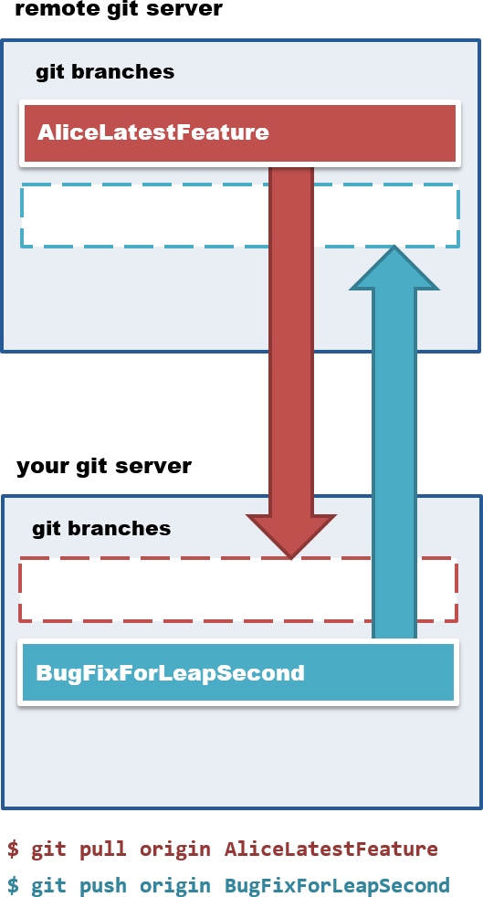

The state of a codebase on a git server, whether an origin repo in a server or on someone's laptop, is represented by one or more _branches_.

 

A _commit_ is a self contained set of code changes (modifications, new, moved and deleted files) made by one developer. A _branch_ is a chronological series of commits that stretches back in time from the most recent change to the beginning of the codebase i.e. the very first commit.

 

The main branch that contains all developers' commits is named `master` by default. The word branch is appropriate as it fits with the tree analogy. The master branch is the root and all other branches fork off from it at some point in time, sharing all early ancestor commits.

 

By applying some of the various git commands available e.g. **commit**, **branch**, **rebase**, **revert**, **merge** etc. branches can be changed on your local repo. But you cannot directly change a branch across on another server, instead you overwrite the remote branch with your local copy.

 

The main two operations for transferring information between two git repositories are **push** and **pull**.

From your git repo you can **push** a branch to the origin, and **pull** a branch from the remote origin repo. Pushing a branch is how you share your code changes with your development collaborators. Pulling a branch is how you obtain the code changes of others.

 

It is worth mentioning that some expert git users consider using **push** and **pull** bad practice (see Caveats appendix for more information). Don't worry about that now though - following the guidelines provided in these git posts will not result in any problems.

 

[git\_index\_](http://lifebeyondfife.com/git/)

[git\_next\_post\_](http://lifebeyondfife.com/checkout-this-branch/)
