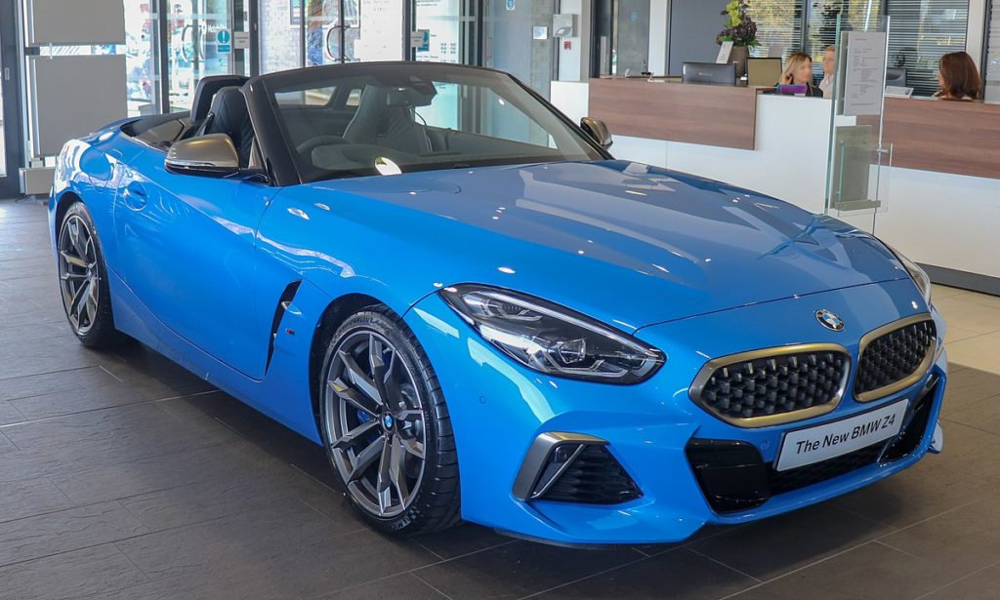
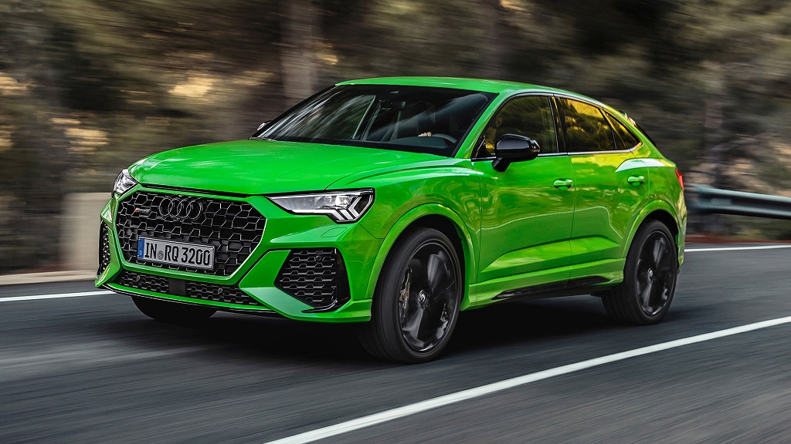
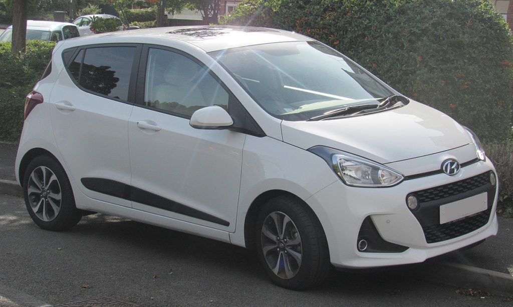

Up to now you may have thought of fitness or looking good as simply losing weight. Or more specifically, losing fat. Everyone knows if you want to lose fat, the key to doing so is down to diet and exercise. Fat is one of the two important energy storage supplies that the body has access to, and by limiting the amount of food you eat, you give the body less raw material to turn into fat; likewise, exercising burns up more fat than being sedantry. You could even write it down as a formula:

\\\[\\partial fat = calories - exercise\\\]

For those needing a calculus refresher, \\(\\partial\\) just means the rate of change of something i.e. the rate of change of fat in the body is equal to how much you eat minus how much you exercise. In order to lose fat, you need the rate of change of fat to be negative (\\(-ve\\)) for a period of time.

  

This simple formula is too much of a simplification, however, owing to its generality. It misses the most important detail: you, and your engine. Think back to the previous post where we looked at standout examples of different athletes. Chris Froome was chosen as the stellar example of an endurance athlete. He is not a big man, and his rippling muscles, though small, easily show through a dangerlously low 5% body fat. While competing in the elite road race tournaments, cyclists will eat upwards of 5,000 calories per day — well over twice the recommended daily calorie intake for the average male. Obviously, the majority of these calories are spent on the gruelling physical challenges of the road, but at such extreme numbers, how can the rate of change of fat be managed so closely?

  

To answer this question we must add a third term to the formula:

\\\[\\partial fat = calories - exercise - engine\\\]

Every person has an engine within themselves that burns calories. It burns as they breathe in and out, it burns while they sit, while they sleep even. And professional athletes have amazing engines — they will burn through the largest calorific banquets while they do nothing more than move from the dining table to the couch. Mere mortals can have this talent as well though. Even noting that genetics plays a part, we all have a friend who can eat huge portions of sugar and fat laden foods without their waistline giving a centimetre, let alone an inch. It is all down to the body’s engine.

  

### Which engine does your body have?

Let’s look at some cars. Here is a BMW Z4. It is small and sporty. Despite being only 1,555kg, it has an impressive bhp of 335 (brake horse power — a measure of its power output) and an mpg of 35.8 (miles per gallon — a measure of its fuel efficiency; the higher, the more efficient). Uses quite an amount of fuel but can move fast with a top speed of 155mph.

BMW Z4

  

Next up the Audi Q3. As an SUV it’s a bulkier beast weighing in at 2,250kg, but the 400 bhp is larger than the BMW. The mpg is a thirstier 31.7, but with an identical top speed of 155mph. The Audi is more powerful but moves exactly as fast as the BMW, requiring more fuel to do so.

Audi RS Q3

  

Let’s compare to the more ordinary Hyundai i10. Weighing in at just 921kg, this skinny vehicle can only muster a top speed of 97mph, with a bhp of 66. The economy of the car is clear in the fact it produces 56.5 mpg.

Hyundai i10

  

The analogy here should be apparent. The Audi is a bulky weightlifter; the BMW is a power/endurance athlete; and the Hyundai is an average person with a healthy amount of body fat, but not particularly fit. Where fuel economy is a good thing in cars, in humans it means that you cannot eat many calories before your rate of change of fat becomes positive and you pile on the pounds.

  

Cars are cars though. They are designed from the ground up and built to an exact specification. Their metrics are fixed. It may take years of work but humans can absolutely change their engine, their frame, their calorific efficiency. And this is the key point about engines: if your only goal is to lose fat, you may succeed only temporarily. Without making a more efficient engine, that weight will come back on again and again because your mpg is too high, your body is too efficient at turning calories into fat unless you have an engine that’s built to burn them away. Also note that having a big engine doesn’t necessarily mean being a big bulky shape. It’s possible to be stong and athletic while still fitting into medium sized clothes.

  

Most people should evaluate the engine they have before starting to get fit and think about how the training schedule they construct will be not just, say, lose some fat, but also change their shape. There are lots of different ways to improve your fitness that will change how much you weigh (remember, muscle is heavier than fat, you could choose to get heavier); how strong, powerful, or enduring you become; or how much food you can burn off by doing absolutely nothing — it’s a handy capability to have. Don’t limit your imagination when thinking about how you could rebuild yourself.

  

[/fitness](https://lifebeyondfife.com/fitness)
