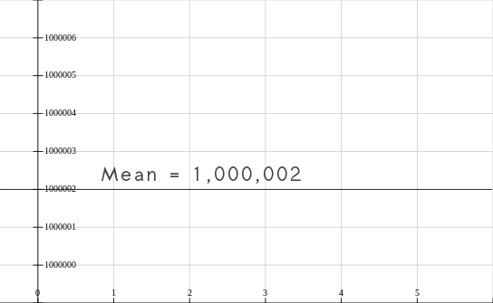
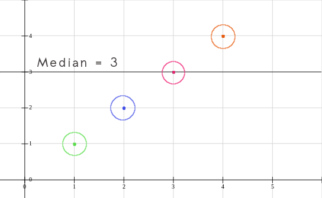
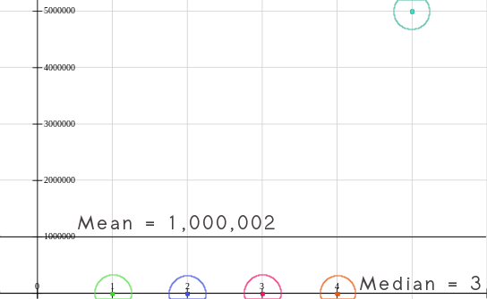

As a non-statistician who every now and then has to understand statistical concepts as if they were second nature, illustrative examples are like gold dust to me. I thought I'd share a small yet extreme sample set that I devised to aid me in understanding the difference between the first [statistical moment](https://en.wikipedia.org/wiki/Moment_%28mathematics%29), the [mean](https://en.wikipedia.org/wiki/Mean), and the similar yet potentially wildly contrasting [median](https://en.wikipedia.org/wiki/Median).

## My problem with mathematical definitions

Before I present my example, I'm going to get on my soapbox for a minute about the way some, often simple, mathematical concepts are taught. Skip to the next section if this is of no interest to you.

When dealing with mathematicians I've often had difficulties with them understanding the distinction between a definition and an explanation. A definition is a terse representation of a concept that contains all of the content that an explanation would have, but can be communicated much more succinctly and easily. Owing to this ease of communication, tutors of mathematics prize definitions over explanations. Unfortunately, unless you're a prodigious mathematician, the understanding - the vital part being sought - doesn't naturally occur without explanations.

I vividly recall the moment I realised this. My doctorate, though in computer science, would require an understanding of algebra, more specifically group theory. I'd found the material at my disposal to be dry and uninformative, every introduction concentrating on the four axioms that define a group: identity, closure, associative, inverse. My second supervisor helpfully arranged for me to attend the undergraduate mathematics course on the subject to help me get up to speed.

My jaw nearly dropped as the lecturer wrote the four axioms on the overhead projector (yes, I'm that old) and quickly moved on to new properties and proofs. What I eventually realised and what I wanted someone to communicate to me was that group theory is the study and application of symmetries. A group is the set of symmetries that an object holds. In the same way whole numbers measure occurrences and rational numbers measure quantities, groups measure symmetry.

Practitioners of mathematics can have a strong grasp of the definitions and how they're applied but without a good implicit understanding, concepts cannot be effectively reasoned with. I recommend all teachers of technical subjects to work at producing analogies, metaphors and examples wherever possible.

And thus concludes my rant.

## Introductory statistical definitions

Now that I've told you my problem with mathematical definitions, here are some simplified mathematical definitions:

- _**Series**: a finite set of samples that describe a probability distribution_

For example, if we want to consider the probability distribution of a set of die rolls, we could roll a die hundreds of times and make a note of each result. Which on a standard six-sided die, or D6 if you will, produces a uniformly distributed number of 1, 2, 3, 4, 5 and 6s.

- _**Moment**: a statistical measure that describes an aspect of the shape of a series_

In order to understand a series, which can sometimes contain millions of numbers, we can make it easier on ourselves by boiling down all the information they contain into readily understandable metrics. A statistical moment is one such metric.

- _**Mean** (first statistical moment): the sum of the samples within the series divided by the number of samples in the series_

More simply, the mean is the average value of the series. For a standard die with a large enough series the mean tends toward 3.5. Let's say for the sake of simplicity we hand pick the smallest sample that has the same distribution as an arbitrarily large number of rolls of a fair six sided die: the six values from 1 to 6. The mean is calculated like this: \\( \\frac{1 + 2 + 3 + 4 + 5 + 6}{6} = 3.5 \\).

- _**Median**: the value of the middle sample in a series with an odd number of samples, or the mean of the middle two samples in a series with an even number of samples_

This definition seems more complex than it actually is purely down to the fact that you calculate it differently depending on whether you have an even or odd number of samples in your series. Given a series, the median is the middle value. So given a series {1, 7, 8}, the median is 7. If the sample is even there isn't _one_ middle element but rather _two_, so we take the mean (average) of the middle two. For example, given a series {1, 3, 7, 8}, we take the average of the middle two samples and get a median of \\( \\frac{3+7}{2} = 5 \\).

## The difference between Mean and Median

The problem in understanding the difference between mean and median values isn't in grasping their individual definitions. Most people implicitly understand average values because of how often it occurs in daily life e.g. splitting a restaurant bill with non-penny pinching friends. The issue is that sometimes the median and the mean are (roughly) the same thing and sometimes they're not.

#### Example 1: Mean = Median

Let's go back to the die rolls. We've already calculated the mean as 3.5, now let's consider the median. For the hand chosen {1, 2, 3, 4, 5, 6} sample we considered earlier, the middle two elements are 3 and 4 and their average is \\(\\frac{3 + 4}{2} = 3.5\\). Both the mean and median values of six sided die rolls tend to 3.5.

In the main, the mean and median are similar if there's a symmetrical distribution at the low and high ends of the series. To help shine a light on the differences we now consider a situation where the ends are seriously skewed.

#### Example 2: Mean ≠ Median

Say we have a small distribution that looks at how much money five people have on them. The first four have £1, £2, £3 and £4 respectively. The fifth person is on their way to Sotheby's, however, and has cashier notes totalling £5m. This is an extremely skewed sample to say the least. First, we calculate the mean, \\(\\frac{1+2+3+4+5000000}{5} = 1000002\\).

Despite no-one having anything near to £1m, the mean is £1,000,002. As the sample size is odd we can simply read off the middle value for the median, namely, 3.

Notice here that the median doesn't capture any information relating to the extreme nature of the top end value. In the end we must recognise that this is too strange and complex a series to capture meaningfully in just one or two single metrics. But it's useful to understand the differing nature of how they each simplify the series.

