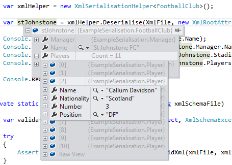
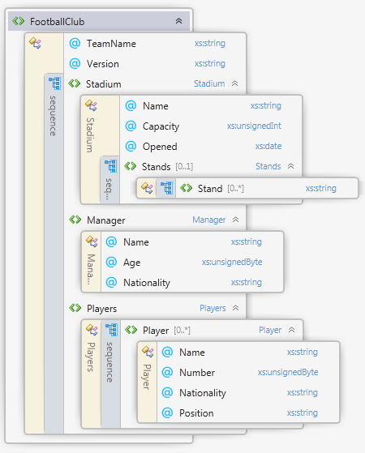
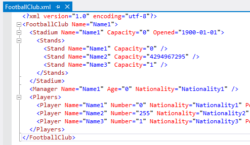

Recently at work I was confronted by a problem requiring data persistance outside of a database - in this case, a saved parameter project file. Though I'm a convert to the purity and ease of use of JSON, in the land of Enterprise coding, XML is still very much king. Visual Studio provides many tools for not just dealing with XML files but also XSD files: a schema for describing a valid XML source file.

Both while at work in creating configuration files, and at home in parsing Amazon's RESTful API results returned in XML data, I've written code to deserialise XML objects into data structures. I find this is the easiest way to get at the information contained therein - much nicer than, say, searching XDocument objects for the correctly named child at just the right sub-element.

I deemed this be the last time I'd ever hunt around for code reminding me how to do it again. I'd turn my serialisation and deserialisation class into a library and put it on [GitHub](https://github.com/lifebeyondfife/XmlSerialisation) and also make my first ever [NuGet](https://nuget.org/packages/XmlSerialisation/) package.

## The Holy Trinity

There are three elements to deserialisation, serialisation and validation with C# and XML.

1. The **XML** file - the file that contains the persisted data that lives in a file on your harddrive
2. The **XSD** file - the schema description that defines a specific format for a valid XML file for your persisted data
3. The **POCO** classes - the C# (.Net) classes that hold your persisted data in the application. POCO, if you haven't heard the term before, stands for Plain Old CLR Objects.

Given a candidate XML file we can ensure it holds to our desired structure by validating it against an XSD file. The XSD file describes the exact structure that our XML files can take e.g. the order and name of the XML elements, the XML attributes, the types of these values. Finally, we have C# classes that define the structure of the deserialised XML file data. Here are the use cases that the library will help us solve.

- **Deserialisation** - The act of creating CLR objects from persisted XML files
- **Serialisation** - The act of creating XML files from CLR objects
- **Validation** - Verifying that an XML file is in the correct format as defined by an XSD schema

## Example XML, XSD, and POCO

The whole idea of creating a library is to make the hard lifting simple so that we end up with just a few lines like this:

using LbF.XmlSerialisation;
namespace Demo
{
    public class Program
    {
        const string XmlFile = @"C:\\St Johnstone.xml";
        const string XsdFile = @"C:\\FootballClub.xsd"

        public static void Main(string\[\] args)
        {
            if (!XmlSerialisationHelper.IsValidXml(XmlFile, XsdFile))
                return;	// Error in XML file

            var xmlHelper = new XmlSerialisationHelper< FootballClub >();
            var stJohnstone = xmlHelper.Deserialise(XmlFile);

            Console.WriteLine("Manager:\\t{0}", stJohnstone.Manager.Name);
        }
    }
}

As you can see, the namespace LbF.XmlSerialisation introduces a generic class, XmlSerialisationHelper which serialises and deserialises XML files against a specified class structure. The namespace also contains a static validation function, the simplest version of which is shown above. The beauty of XSD schema validation is that if there are any unexpected XML elements or missing attributes, the validation process will let us know exactly what's wrong - and more importantly exactly where in the XML file the error occurred. Consult the full API for an IsValidXml method that returns detailed error reporting via an out parameter.

The example above can be examined in full at [GitHub](https://github.com/lifebeyondfife/XmlSerialisation) where you can deserialise an XML file that, among other things, lists the first eleven of Tayside's finest: [St Johnstone FC](http://www.perthstjohnstonefc.co.uk/), and also a set of C# classes extensively littered with .Net Attributes that show exactly how to create accompanying CLR structures for your own XML files.

If you're not interested in looking at the code but would just like to use the library in your own C# projects, simply search NuGet in Visual Studio for "XmlSerialisation" and add an `import LbF.XmlSerialisation;` statement to your source code.

## Excess Dee?

The XML file format is certainly ubiquitous on all platforms and for many different uses. The other TLA I've mentioned, however, XSD, may not be familiar to all. It is itself an XML file but it's an XML file that specifically defines an allowed format for other XML files.

To be clear from confusion, it doesn't enforce (just) the tag and element structure. It defines what a valid XML document looks like for a specific purpose. It will define what the root element name should be; what the child elements should be; the types of every element and attribute; whether any given element or attribute is optional or mandatory; whether there is only one element of a given type allowed or an arbitrary collection.

The reason for defining such a strict standard on XML is that, once an XML document has be cleared as successfully adhering to a given XSD format, we can deserialise safely knowing that all the types and structure is exactly as we expect it to be. Visual Studio can also help us by providing an illustrative graphic representation of an XSD.

Another advantage of creating an XSD file is that Visual Studio can auto generate an example XML document for testing purposes. And good test data it is. If you state that a certain element is an unsigned int, the auto generated example may create values of 4,294,967,295 to test your system can handle the upper limit. 

## Words of Warning

The most recent scares regarding the [exploits of Ruby on Rails](http://news.ycombinator.com/item?id=5145397) were down to a YAML library that deserialised arbitrary content and executed it. How can you deserialise something in a secure way, you may ask. The answer is, you can't. Let me repeat that one more time. If you care about security, don't execute code on objects created by deserialised data whose origins are outwith your control. In my St Johnstone example above, the POCO objects I'm creating are simply instantiating collections of value and string types - the classes contain no methods. You should treat all values you produce from a deserialised object as potentially harmful.

Don't let this warning put you off, however. Serialisation and deserialisation is a great tool to move data from in your program to data on your harddrive and vice versa. I hope you find my first [NuGet package](https://nuget.org/packages/XmlSerialisation/) useful.
